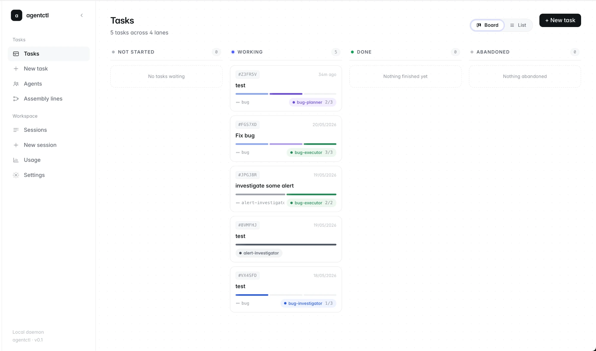

# agentctl

> Run AI coding-agent sessions on your own machine — sandboxed, multi-provider,
> and orchestrated through a Kanban-style task board and assembly-line
> workflows you control.

Each session lives in its own Docker container with the right agent SDK, your
MCP servers, your skills, and (optionally) a clone of your repo. The CLI
(`agentctl`) and Web UI both talk to a single local daemon (`agentd`) that
owns the database and container lifecycle, so you can detach from a session
and reattach later without losing state.

Kanban-style task board. Replace this image with a real capture — see [`docs/screenshots/README.md`](docs/screenshots/README.md).

---

## Features

### Containerised chats
Every session runs in its own Docker container on its own bridge network with
its own working volume. The agent never touches your host filesystem outside
the repo you hand it, and one session can't see another. Stop the session and
the blast radius goes with it. Skills are bind-mounted (not baked into the
image), so iterating on a prompt or skill is instant — no rebuild required.

### Multi-provider: Claude Code and OpenAI Codex
agentctl ships with first-class support for two coding-agent runtimes today:

- **Claude Code** (Anthropic) — via the Claude Agent SDK, authenticated with
  your Claude subscription OAuth (Pro/Max) or an `ANTHROPIC_API_KEY`.
- **OpenAI Codex** — for sessions and assembly-line stages that should run on
  GPT-class models. Configured via `OPENAI_API_KEY`.

Each session **or each stage of an assembly line** can pin its own provider,
so a single workflow can investigate on Claude and execute on Codex without
forking agent YAMLs. The run view surfaces the provider/model per stage as a
first-class chip.

> **Roadmap — additional agent runtimes.** The provider layer is built to be
> pluggable. The next runtimes on the list:
> - **opencode** — community open-source coding agent
> - **Cursor Agent** — Cursor's agent CLI
> - **Aider** — local pair-programming agent
> - **Gemini Code Assist / Code CLI**
>
> Track progress and chime in on [GitHub Issues](https://github.com/agentctl/agentctl/issues?q=label%3Aprovider) labelled `provider`.

### Kanban-style task management
The Web UI ships a task board with four columns — **Not started**,
**Working**, **Done**, **Abandoned** — that mirrors how you actually run
agent work. Each card shows the assembly line it's running, the current
stage, the cost so far, and any pending handoff. Drag-free switching between
**Board** and **List** view is built in, and the same data is available from
the CLI (`agentctl task ls`).

### Assembly lines for tasks
Instead of one omniscient agent, define small, role-scoped agents and chain
them into a workflow. A task moves through stages — **investigate → plan →
execute → review** — with each stage owned by the right agent and the right
tools. When a stage finishes, run `agentctl task handoff <id>` (or click
**Handoff** in the UI) to advance to the next stage, carrying the prior
stage's output forward as context. You stay in the loop at every seam
instead of letting one agent drift end-to-end.

The shipped reference assembly line is
[`internal/ttl/builtins/assembly-lines/bug.yaml`](internal/ttl/builtins/assembly-lines/bug.yaml).
A multi-provider variant
([`bug-multi-provider.yaml`](internal/ttl/builtins/assembly-lines/bug-multi-provider.yaml))
investigates on Claude and executes on Codex.

### Pre-defined agents (built-ins)
agentctl ships with a curated set of role-scoped agents that you can use
as-is or fork as a starting point for your own:

| Agent | Role | Source |
|---|---|---|
| `bug-investigator` | Reproduces the bug, gathers evidence, writes a synthesis | [`agents/bug-investigator.yaml`](internal/ttl/builtins/agents/bug-investigator.yaml) |
| `bug-planner` | Reads the investigation, picks a fix, writes a test plan | [`agents/bug-planner.yaml`](internal/ttl/builtins/agents/bug-planner.yaml) |
| `bug-executor` | Implements the plan, runs tests, opens a PR | [`agents/bug-executor.yaml`](internal/ttl/builtins/agents/bug-executor.yaml) |

Each agent has its own system prompt, MCP allow-list, and tool surface — no
hidden tool surface, no "what is this agent allowed to do?" guesswork. Define
your own with `agentctl agent add` or in the Web UI's **Agents** editor.

### Skills and MCP servers — first-class and explicit
- **Skills** are folders under `~/.local/share/agentctl/custom-skills/` that
  get bind-mounted into every session container at `/skills/`. Edit in place;
  changes take effect at next session start.
- **MCP servers** are kept in a local registry and attached to a session by
  name (`agentctl start --repo … --mcp my-server`).

### Same data, two clients
Drive everything from your terminal (`agentctl start`, `attach`, `ls`,
`task handoff`, …) or from the local Web UI at `http://127.0.0.1:7777`
(`agentctl ui`). Both clients talk to the same `agentd` over the same
internal API — a session you started on the CLI shows up in the UI and vice
versa.

---

## Install

Requires Docker (Desktop or Engine) and a Linux/macOS host. Then:

    bash installer/install.sh
    agentctl init

`init` does the first-time setup end-to-end: Docker reachability check,
session base image build, prompts for credentials, MCP registry seed, and
`systemd --user` / `launchd` service install. It is idempotent — re-run it
any time to repair drift.

To upgrade an existing checkout — pull the latest changes, rebuild, and
restart the daemon in one step:

    bash installer/update.sh

## Authenticate

agentctl supports authenticating sessions with either provider. Pick whichever
matches how you already use coding agents.

### Claude (Anthropic)

**Option A — Claude subscription (recommended if you have Pro/Max):**

    agentctl auth login

This builds a one-shot helper container, runs `claude auth login` inside it,
and stores the OAuth credentials under
`~/.config/agentctl/claude/.credentials.json`. From then on, every session
bind-mounts those credentials and authenticates as you — no API key billing,
no `ANTHROPIC_API_KEY` env var.

**Option B — `ANTHROPIC_API_KEY`:**

If `init` doesn't find OAuth credentials, it prompts for `ANTHROPIC_API_KEY`
and validates it with a minimal authenticated request. The key lives in
`~/.config/agentctl/secrets.json` (`0600`) and is injected into each session
container at start.

**Option C — Custom Anthropic-compatible gateway:**

    agentctl init --anthropic-base-url https://gw.example/v1 \
                  --anthropic-auth-token <bearer>

### OpenAI (Codex)

    agentctl init --openai-key sk-…

…or set `OPENAI_API_KEY` and re-run `agentctl init`. Sessions or assembly-line
stages that pin `provider: openai` will use it automatically.

Check what's configured at any time:

    agentctl auth status

## Start your first session

    agentctl start --repo https://github.com/me/myrepo.git

An interactive console opens. Type messages, watch the agent work, hit Ctrl-D
to detach (the session keeps running). Reattach any time:

    agentctl ls
    agentctl attach <session-id>

Prefer a UI?

    agentctl ui

…opens `http://127.0.0.1:7777` in your browser.

## Commands at a glance

| Command          | Purpose                                                   |
|------------------|-----------------------------------------------------------|
| `init`           | First-time setup; idempotent repair.                      |
| `auth login`     | Authenticate with your Claude subscription (OAuth).       |
| `auth status`    | Show whether sessions use an API key or OAuth.            |
| `update`         | Rebuild the session base image and repin its id.          |
| `config`         | Read or write a `config.toml` key.                        |
| `ui`             | Open the local Web UI in a browser.                       |
| `start`          | Create a session and attach to its event stream.          |
| `attach`         | Attach to a running session's event stream.               |
| `detach`         | Help text: detach is Ctrl-D / Ctrl-C from start/attach.   |
| `ls`             | List sessions.                                            |
| `stop`           | Terminate a session and remove its container + volume.    |
| `restart`        | Recreate a session container from the pinned image.       |
| `interrupt`      | Cancel a session's in-flight turn.                        |
| `logs`           | Tail daemon, session, or container logs.                  |
| `mcp`            | Manage the MCP registry.                                  |
| `skill`          | Manage built-in and custom skills.                        |
| `task`           | Manage tasks running on an assembly line (`handoff`, `ls`).|
| `doctor`         | Run install + connectivity checks (`--fix`, `--repair-db`).|
| `version`        | Print version info.                                       |

Run `agentctl <command> --help` for command-specific flags.

## Troubleshooting

First stop:

    agentctl doctor

…prints the state of every install + connectivity check. Useful flags:

- `--fix` — apply known repairs idempotently.
- `--repair-db` — vacuum the sqlite database.
- `--json` — machine-readable output for scripting.

See [`TROUBLESHOOTING.md`](TROUBLESHOOTING.md) for known failure modes and
recipes.

## Architecture (one-paragraph version)

agentctl is a single Go binary that runs as either the CLI or, when launched
by systemd/launchd, the `agentd` daemon. agentd owns sqlite
(`~/.local/share/agentctl/agentd.db`), the Docker SDK, and a per-session
actor that orchestrates the container lifecycle plus a control-channel socket
bind-mounted into each container. Full details:
[`architecture/overview.md`](architecture/overview.md).

## Developing

    git clone https://github.com/agentctl/agentctl.git
    cd agentctl
    bash installer/install.sh           # lays down image build context + binary
    go test ./...
    cd web && npm ci && npm run build   # rebuild the SPA bundle

Repository layout:

- `cmd/agentctl/`   — single-binary entry point (CLI + agentd).
- `internal/`       — Go packages.
- `image/`          — Docker build context for the session base image.
- `builtin-skills/` — curated baseline skills shipped with installs.
- `web/`            — React + Vite SPA served by agentd.
- `architecture/`   — design docs and ADRs.
- `installer/`      — `install.sh` and signature payload.

## Contributing

Contributions are welcome. Please read [`CONTRIBUTING.md`](CONTRIBUTING.md)
for how to file an issue, propose a change, and run the test suite, and the
[`Code of Conduct`](CODE_OF_CONDUCT.md) for community expectations. To
report a security issue privately, see [`SECURITY.md`](SECURITY.md).

## License

Licensed under the [Apache License, Version 2.0](LICENSE).
Copyright © 2026 Vipul Sodha. See [`NOTICE`](NOTICE) for attribution
requirements.
