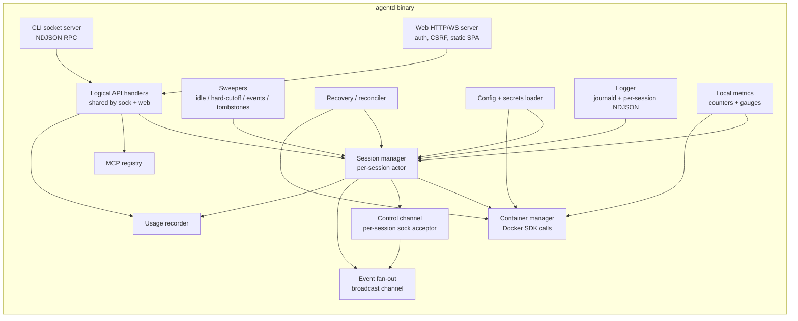

# agentd internal design

`agentd` is a single binary with no external dependencies beyond the
Docker daemon and sqlite. It is implemented as a structured-concurrency
service: a small set of long-lived goroutines / tasks coordinating via
channels, plus per-session worker tasks.

> Implementation language is decided by the implementing team (Go and
> Rust are both viable). The shape below is language-agnostic; signal
> handling and goroutine-equivalents map cleanly to either.

## 1. Module breakdown



| Module | Responsibility | Lifetime |
|---|---|---|
| `cfg` | Load and watch `config.toml` and `secrets.json`. Re-read on SIGHUP. | Process |
| `log` | Initialize structured logger; spawn per-session log writer. | Process + per-session |
| `rec` | Run the reconciliation algorithm (`overview.md` §7) at startup. | Once at boot |
| `mcp` | CRUD over the `mcp_registry` table. Cache for read; write-through. | Process |
| `cm` | Wrap Docker SDK calls (`create`, `start`, `stop`, `kill`, `rm`, `ps`, network create/remove). | Process |
| `sm` | Owns the per-session **actor**: queue, in-flight state, control-sock connection. | Per session |
| `cc` | Listen on each session's control socket; deliver frames to that session's actor. | Per session |
| `fan` | Broadcast queue of events to attached clients. Reads come from session actor; writes fan out to N subscribers. | Per session |
| `usage` | Insert `usage` rows on `turn.end` events with token data. | Process |
| `sweep` | Periodic tasks: idle-stop, hard-cutoff, idem-cache cleanup, tombstone reaping, events table prune. | Process |
| `sock` | Unix-socket accept loop, frame decode, dispatch to `api`. | Process |
| `web` | HTTP/WS server, auth, CSRF, route to `api`. | Process |
| `api` | Pure handlers: take a request, return a response or stream. Single source of "do the right thing." | Process |
| `metrics` | In-process counters (atomic ints) + a `/v1/metrics` endpoint (auth'd, JSON). | Process |

### 1.1 Session manager (the actor model)

Each session runs as a small actor with three inputs and a few outputs:

```text
inputs:
  - control_in    : frames from the container shim
  - api_in        : SendMessage / Interrupt / Snapshot / Detach / Restart / Terminate
  - sweeper_in    : "stop me" / "hard-cutoff me" / "image refresh available"

outputs:
  - control_out   : frames to the container shim
  - fanout        : events to attached clients
  - db_writes     : sessions row updates, lifecycle log inserts, usage inserts
  - cm_calls      : container start/stop/remove, network ops

state:
  - session_id, status
  - queue : FIFO of {message_id, content, client_id, accepted_at}
  - in_flight : Option<turn_id>
  - subscribers : list of fanout channels
  - last_activity_at : Time
  - control_conn : Option<Connection>
  - event_seq, event_buffer (1k ring)
```

The actor processes one input at a time (single-threaded mailbox).
Concurrency between sessions is parallel; concurrency within a session
is strictly serialized — this is what makes §15.4's "queue and serialize"
trivial to implement.

Output side-effects (Docker calls, DB writes) happen in worker tasks
spawned from the actor so the mailbox never blocks on I/O.

### 1.2 Control channel layer

For each `running` session, `agentd` listens on
`~/.local/share/agentctl/sessions/<id>/control/agentd.sock`. The shim
connects from inside the container.

- `cc` accept loop: when a new connection arrives, it reads
  `runtime.hello` and verifies `session_token` against the row. On
  success, it hands the connection to the session actor as
  `control_conn`. On failure, close.
- The actor reads `runtime.event` frames in a loop, decodes them, and
  enqueues to its mailbox. Outbound writes (`agentd.message`,
  `agentd.interrupt`, …) go through the same connection.
- One active connection per session. A second connect is rejected with
  `agentd.error{already_connected}` (api.md §4.4).
- On connection drop: actor marks `control_conn = None`. A heartbeat
  timeout (30s without any frame) marks the session `stopped` and
  emits `session.stopped{reason: "control_lost"}`.

## 2. Concurrency model — the real-world walkthrough

This section is the canonical statement of how §15.4 works in code.

### 2.1 Single-client, single-message

1. `api` validates the request and calls `sm.send_message(session_id,
   body)` which posts to the actor mailbox.
2. Actor: `if in_flight.is_none()` → emit `user.message`,
   `turn.start{turn_id=ULID}`, write `agentd.message` on control_out,
   set `in_flight = turn_id`.
3. Actor receives `runtime.event` frames; rewrites each as a fan-out
   event with a fresh `seq` and pushes into the buffer + DB events
   table.
4. On `runtime.event{kind=turn.end}`: actor writes `usage` row, emits
   `turn.end`, clears `in_flight`, dequeues next if any.

### 2.2 Same client sends two in quick succession

Second message arrives while `in_flight = turn_X`. Actor enqueues; emits
`queue.depth=1`. Client renders "queued." When `turn_X` ends, actor
dequeues and starts a new turn. Order preserved.

### 2.3 Two clients send "simultaneously"

Both `POST`s land at the HTTP server (or socket server) and hit `api`.
Each spawns a small handler that posts to the actor mailbox. Whichever
hits the mailbox first wins arrival order. Mailbox is FIFO — the second
becomes `queue.depth=1`. Both clients see the same queue events because
they're attached to the same fan-out.

### 2.4 Interrupt while in-flight

1. `api.interrupt(session_id)` posts `Interrupt{clear_queue?}` to mailbox.
2. Actor: `if in_flight.is_none()` → reply
   `precondition_failed{no_in_flight}`. Else: write
   `agentd.interrupt{reason: user}` on control_out; do **not** clear
   `in_flight` yet.
3. Shim sends SIGINT to the runtime; runtime emits
   `runtime.event{turn.cancelled}`; actor maps it to fan-out
   `turn.cancelled`, clears `in_flight`, then if `clear_queue` was true
   drops queued items, else dequeues normally.

### 2.5 Idle-stop fires mid-turn

The idle sweeper (per overview.md §6.4) skips sessions where
`in_flight=1 OR queue_depth>0`. The hard-cutoff sweeper does **not**
skip; on hard-cutoff:

1. Sweeper posts `HardCutoff` to mailbox.
2. Actor sends `agentd.interrupt{reason: hard_cutoff}` and waits up to
   30s for `turn.cancelled`. If absent, sends `agentd.shutdown`.
3. Stop the container, mark `stopped`. Emit `session.stopped{reason:
   hard_cutoff}`.

## 3. Event fan-out

A simple per-session `BroadcastChannel<Event>` whose subscribers are
attached clients. Each `AttachStream` request creates a subscription:

- The handler writes a `session.snapshot` event from the actor's current
  state.
- Then registers as a subscriber and forwards events until the client
  disconnects.
- On disconnect: drop the subscription.

If `since_event` is set, the handler:

1. Fetches all events with `seq > since_event.seq` from the in-memory
   ring; if the ring's lowest seq is higher than `since_event.seq + 1`,
   falls back to the `events` table (data-model.md §2). If even that's
   too old, returns `error{buffer_overflow}`.
2. Streams those, then the live tail.

Slow subscriber backpressure: each subscription has a bounded buffer of
256 events. If the buffer fills (slow client), the subscription is
dropped with a `stream_end{reason: slow_consumer}`. The client must
reconnect with `since_event` to catch up; this prevents a hung client
from stalling fan-out for everyone.

## 4. Backpressure & rate-limiting from container

(Restating api.md §4.5 in implementation terms.)

Per-session token bucket on inbound `runtime.event` frames:

- 100 frames/s sustained, 200 burst.
- On exceeding: drop frames where `kind=assistant.delta`; never drop
  `tool.*`, `turn.*`, `usage`, `runtime.error`.
- Emit `runtime.throttled{active=true}` once when throttling kicks in;
  `active=false` when sustained traffic falls under the limit for >5s.
- 60s sustained throttling ⇒ session marked `error`, control sock
  closed, container stopped. The runtime is misbehaving; we contain
  the damage rather than push the cost up.

## 5. Sweepers

All sweepers live in one `sweep` module, scheduled via a single ticker
(60s default) that walks each sweeper. Each sweeper is idempotent and
safe to overlap.

| Sweeper | Trigger | Action |
|---|---|---|
| `idle_stop` | every 60s | SELECT sessions WHERE status='running' AND in_flight=0 AND queue_depth=0 AND last_activity_at < now-`idle_timeout`. Stop each via session actor. |
| `hard_cutoff` | every 60s | SELECT sessions WHERE status IN ('running','stopped') AND last_activity_at < now-`max_idle`. If running, `Interrupt` then `Stop`. Mark a flag so subsequent resume is allowed but logged. |
| `idem_cleanup` | every 5 min | DELETE FROM message_idempotency WHERE accepted_at < now-5m. |
| `events_prune` | every hour | DELETE FROM events WHERE at < now-24h OR (session_id, seq) below per-session caps. VACUUM not run automatically. |
| `tombstone_reap` | every 6h | rm -rf sessions/.tombstones/* older than 7 days. |

Sweepers log every action they take to the daemon log; counts to the
metrics module.

## 6. Service unit contents

### 6.1 systemd `--user` unit (Linux)

`~/.config/systemd/user/agentd.service`:

```ini
[Unit]
Description=agentctl daemon
After=docker.service default.target
Requires=docker.service
StartLimitIntervalSec=300
StartLimitBurst=5

[Service]
Type=notify
ExecStart=%h/.local/bin/agentd
Restart=on-failure
RestartSec=2s
TimeoutStopSec=60
Environment=AGENTCTL_HOME=%h
# stderr is captured by journald automatically.
StandardOutput=journal
StandardError=journal
WatchdogSec=30s

# Filesystem & process hardening (the daemon doesn't need root or wide fs access).
ProtectSystem=full
ProtectHome=read-write
NoNewPrivileges=true
PrivateTmp=true
LockPersonality=true
RestrictSUIDSGID=true
SystemCallFilter=@system-service
SystemCallErrorNumber=EPERM

[Install]
WantedBy=default.target
```

Notes:

- `Type=notify` so we can integrate sd_notify for "ready after reconcile."
- `WatchdogSec=30s` gives systemd a kill-switch if `agentd` deadlocks.
- `Requires=docker.service` would only work for system docker (Linux
  native package). For Docker Desktop on Linux, we soften to `Wants=`.
  `init` detects which is in use and writes the right unit.

### 6.2 launchd plist (macOS)

`~/Library/LaunchAgents/com.agentctl.agentd.plist`:

```xml
<?xml version="1.0" encoding="UTF-8"?>
<!DOCTYPE plist PUBLIC "-//Apple//DTD PLIST 1.0//EN"
  "http://www.apple.com/DTDs/PropertyList-1.0.dtd">
<plist version="1.0">
<dict>
  <key>Label</key>             <string>com.agentctl.agentd</string>
  <key>ProgramArguments</key>
  <array>
    <string>/usr/local/bin/agentd</string>
  </array>
  <key>RunAtLoad</key>         <true/>
  <key>KeepAlive</key>
  <dict>
    <key>SuccessfulExit</key>  <false/>
    <key>NetworkState</key>    <true/>
  </dict>
  <key>ProcessType</key>       <string>Background</string>
  <key>ThrottleInterval</key>  <integer>2</integer>
  <key>EnvironmentVariables</key>
  <dict>
    <key>AGENTCTL_HOME</key>   <string>/Users/USER</string>
  </dict>
  <key>StandardOutPath</key>   <string>/Users/USER/Library/Logs/agentctl/agentd.log</string>
  <key>StandardErrorPath</key> <string>/Users/USER/Library/Logs/agentctl/agentd.log</string>
</dict>
</plist>
```

(`USER` substituted at install time.)

`init` writes the plist and runs `launchctl bootstrap gui/$(id -u)
~/Library/LaunchAgents/com.agentctl.agentd.plist` then `launchctl
kickstart -k gui/$(id -u)/com.agentctl.agentd`.

### 6.3 Foreground fallback

If the system service install fails (R1 error case), `agentctl init`
prints a warning and runs `agentd` in the foreground for the current
session only. Documented as expected behavior; the developer's next
login won't auto-start `agentd` in this mode.

## 7. Error code → CLI exit code mapping

| API error code | CLI exit | User-facing example |
|---|---|---|
| `bad_request` | 64 | "unknown flag --foo" |
| `not_found` | 4 | "no session sess_…" |
| `conflict` | 4 | "MCP 'github' already exists" |
| `precondition_failed` | 4 | "no in-flight turn to interrupt" |
| `unauthenticated` | 3 | (web only; never via CLI socket) |
| `forbidden` | 3 | (web only) |
| `unavailable` | 2 | "agentd reconciling — retry in 2s" |
| `rate_limited` | 5 | "session is throttled" |
| `runtime_error` | 5 | "container exited code 1" |
| `version_mismatch` | 2 | "your agentd is older than agentctl" |
| `internal` | 1 | "unexpected error; see /tmp/agentctl-XXXX.log" |

The CLI also writes a transcript of the request and the error to
`~/.local/state/agentctl/last-error.log` for `agentctl doctor`.

## 8. Process lifecycle

### 8.1 Startup sequence

1. Drop privileges if started as root by accident (we exit instead;
   running as root is a user-error).
2. Open structured logger.
3. Load `config.toml`.
4. Open `agentd.db`; run pending migrations.
5. Verify Docker connectivity (3-attempt retry over 10s).
6. Run reconciler (overview.md §7).
7. Start sweepers.
8. Bind CLI socket and HTTP/WS port.
9. `sd_notify(READY=1)` (Linux) / mark healthy (macOS).
10. Begin accepting clients.

If any step 1-7 fails, exit non-zero with a structured error; systemd /
launchd will restart with backoff. We never accept clients while the
DB or Docker is unhealthy — better to fail closed.

### 8.2 Shutdown sequence

On SIGTERM:

1. Stop accepting new clients.
2. Drain in-flight CLI/HTTP requests (10s budget; longer ones are
   dropped with a clean `stream_end`).
3. For each session actor: write current state, close fan-out
   subscriptions cleanly. **Do not** stop containers — they survive
   `agentd` restart and will be re-adopted on next start.
4. Close DB.
5. Exit 0.

On SIGKILL or panic: there's no clean shutdown; the reconciler handles
recovery on next start.

### 8.3 Reload

SIGHUP triggers `cfg.reload()`:

- Re-read `config.toml`. Reject if invalid; log error and keep current
  config.
- Apply tunables that are safe to change live: `idle_timeout`,
  `max_idle`, `log_level`, `pricing.tables` (new rows use new prices).
- Tunables that need a restart: `web_addr`, `image.ref`. We log a warning
  and continue with the old value.

## 9. Testing surface for the daemon

Listed in detail in `phasing.md` per milestone; summary:

- Unit tests on the actor mailbox (queueing, interrupt, fan-out).
- Integration tests with a fake Docker (a tiny in-process emulator that
  satisfies the subset of the API we use).
- E2E tests with real Docker on Linux CI for image-pull, network
  policy, reconcile.
- Fault injection: kill agentd at every reasonable point; verify
  reconcile produces the expected outcome.
