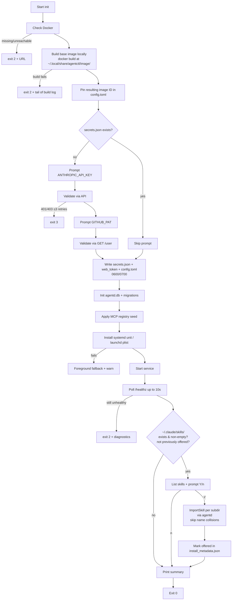

# Install, update, doctor

## 1. Distribution

`agentctl` and `agentd` ship as a single binary (subcommand-based: the
binary inspects `argv[0]` and routes to either CLI or daemon entry).
The Web UI SPA is embedded in the binary (`go:embed` / `include_bytes!`
equivalent), so there is no separate asset bundle.

### 1.1 Canonical install path: `install.sh`

The supported install path is a one-line shell command, modeled on
Claude Code's installer:

```bash
curl -fsSL https://install.agentctl.dev/install.sh | bash
```

A pinned version is also supported:

```bash
curl -fsSL https://install.agentctl.dev/install.sh | AGENTCTL_VERSION=v0.2.3 bash
```

The script is hosted at the URL above (CNAME to GitHub Pages or an S3
static site backing the GitHub Releases binaries). It is the same
script for macOS and Linux.

### 1.2 What `install.sh` does

1. Detect host: OS in {`linux`, `darwin`}, arch in {`amd64`, `arm64`}.
   Refuse on anything else with a clear message.
2. Resolve target version: `AGENTCTL_VERSION` env var, else "latest"
   from the GitHub Releases API.
3. Download `agentctl-<version>-<os>-<arch>.tar.gz` and the matching
   `.sha256` and `.minisig` (or `.cosign.bundle`) from GitHub Releases.
4. Verify the SHA256 and the signature against an embedded public key
   baked into the script. Abort on mismatch — never run an unverified
   binary.
5. Extract to `${INSTALL_DIR:-$HOME/.local/bin}/agentctl`, `chmod +x`.
6. If the install dir is not on `PATH`, print the exact `export PATH=…`
   line for the user's shell.
7. Write `~/.local/share/agentctl/install_metadata.json`
   (version, install method, install timestamp, source URL) so
   `agentctl doctor` and a future self-update path can introspect.
8. Print:
   ```
   agentctl <version> installed.
   Next: agentctl init
   ```

The script does **not**:
- start `agentd`,
- write secrets,
- install the system-service unit,
- prompt for anything.

All of that is `agentctl init`'s job (§2). This separation keeps the
installer non-interactive — safe to run from CI, dotfiles, provisioning
tools — and keeps `init` the single place that touches user state.

### 1.3 Environment variables honoured by `install.sh`

| Var | Purpose | Default |
|---|---|---|
| `AGENTCTL_VERSION` | Pin to a specific release tag. | latest |
| `INSTALL_DIR` | Where to drop the binary. | `$HOME/.local/bin` |
| `AGENTCTL_INSTALL_NO_VERIFY` | Skip signature verification. Loud-warns; intended only for offline mirror setups. | unset (verification on) |
| `AGENTCTL_DOWNLOAD_BASE` | Override the release host (private mirror, air-gapped install). | `https://github.com/<org>/agentctl/releases/download` |

### 1.4 Idempotency and upgrade

Re-running `install.sh` against an existing install:

- If the resolved version matches the on-disk version, no-op (prints
  "agentctl <v> already installed").
- Otherwise: download new version, verify, atomically replace the
  binary (`install.sh` writes to `agentctl.new`, then `mv` over the
  old). The next invocation of `agentctl` picks up the new binary.
- The system-service unit is **not** restarted by `install.sh`. The
  developer runs `agentctl init --repair` (which restarts `agentd`)
  after a binary upgrade to apply any unit-file changes and pick up
  the new daemon. A future v1.1 can wire `agentctl self-update` as a
  thin wrapper that does both.

So "re-run `install.sh`" is the v1 self-update story. Native
`agentctl self-update` (no curl pipe) remains a v2 candidate
(`v2-requirements.md`).

### 1.5 Uninstall

```bash
curl -fsSL https://install.agentctl.dev/install.sh | bash -s -- --uninstall
```

Removes `${INSTALL_DIR}/agentctl`, the system-service unit (`systemctl
--user disable --now agentd` / `launchctl bootout`), and prints the
paths to `~/.config/agentctl/` and `~/.local/share/agentctl/` for the
developer to remove manually if they want a clean wipe. We do **not**
auto-remove user data; volumes may contain working code.

### 1.6 Why not native packages

Native packages (Homebrew tap, `.deb`, `.rpm`, `.pkg`) were considered
and dropped from v1:

- Five distribution channels = five test matrices, five release
  pipelines, and five places for the install story to drift.
- A single signed-binary tarball pulled by a tiny shell script
  is portable across every Linux distro and macOS version we
  support, with no per-distro packaging metadata.
- The signature-verified `install.sh` is the same security posture as
  signed package metadata, without the package-manager indirection.

If post-v1 demand exists for `brew install agentctl` (developer-tool
ergonomics) we add the Homebrew tap as an additional channel; the
binary doesn't change. Same for `.deb` / `.rpm` if a customer needs
unattended provisioning via apt/dnf.

### 1.7 What the install script lays down

After `install.sh` runs successfully, the developer's machine has:

- `${INSTALL_DIR}/agentctl` — the binary.
- `~/.local/share/agentctl/image/` — the Docker build context
  (`Dockerfile`, the Python shim source under `shim/`, entrypoint,
  config templates) used by `agentctl init` and `agentctl update` to
  build the session base image locally. The shim drives
  `claude-agent-sdk` (Python) directly inside the container; there is
  no separate `claude-code` CLI subprocess. See
  container-and-image.md §1.2 and ADR 0014.
- `~/.local/share/agentctl/builtin-skills/` — the project's curated
  baseline skills, replaced atomically on every `install.sh` run.
  Read-only to `agentd`; the developer's `agentctl skill` CLI cannot
  edit these.
- `~/.local/share/agentctl/install_metadata.json` — install
  bookkeeping. Schema:

  ```json
  {
    "version": "0.2.3",
    "install_method": "install.sh",
    "installed_at": "2026-05-10T12:00:00Z",
    "source_url": "https://github.com/.../release.tar.gz",
    "claude_import_offered_at": null,
    "claude_imported_skills": []
  }
  ```

  The `claude_*` fields are written by `agentctl init`'s skills
  import phase (§2.2 step 12); `install.sh` itself only writes
  the first four.

That's it. No system-service unit, no config, no secrets, no DB, no
built image — those land in `agentctl init` (§2). In particular, the
`docker build` of the session base image runs during `init`, not in
the installer.

## 2. `agentctl init` — full flow

This is the single entry point for first-time setup. It is also
re-runnable; see §3.4 for repair semantics.

### 2.1 Phases



### 2.2 Phase-by-phase detail

1. **Check Docker.** Runs `docker info`. On non-zero or no socket: exit
   with platform-specific URL (`https://docs.docker.com/desktop/install/mac-install/`,
   `…/linux-install/`). No further action.
2. **Build base image.** Runs `docker build -t agentctl/session-base:local
   ~/.local/share/agentctl/image/`. Streams Docker's build output to
   the terminal (with a phase header so the developer sees progress on
   each layer). On a fresh machine this is ~3–10 minutes (debian +
   apt + node + python + pip install of claude-agent-sdk + shim deps); on a re-run with cache
   it is seconds. On failure: exit 2 with the captured tail of the
   build log and a remediation pointer (`agentctl init --repair`).
3. **Pin image ID.** `docker inspect agentctl/session-base:local
   --format '{{.Id}}'` → write to `config.toml` `[image].pinned_id`.
   The previous value (if any) is moved to `[image].previous_id` for
   `agentctl update --rollback`.
4. **Token prompts.** Only if `secrets.json` doesn't already contain the
   relevant key. `--reset-token anthropic|github` forces re-prompt for
   the specified token.
5. **Validate.** `ANTHROPIC_API_KEY`: a minimal authenticated request
   (e.g., `GET /v1/models` with the key; a 200 confirms). `GITHUB_PAT`:
   `GET /user` with `Authorization: Bearer <pat>`. Three retries each.
6. **Write secrets.** Mode `0600`, parent `0700`. If the file already
   exists with wrong perms, fix and warn (R1 error case).
7. **DB init.** Open `agentd.db` (creates if absent). Run all
   migrations.
8. **Registry seed.** Resolve seed file (user → site → embedded;
   §15.6). `INSERT OR IGNORE` into `mcp_registry`.
9. **Service install.** Linux: write `~/.config/systemd/user/agentd.service`
   (agentd.md §6.1), run `systemctl --user daemon-reload`,
   `systemctl --user enable agentd`. macOS: write the plist
   (agentd.md §6.2), `launchctl bootstrap`. Both: enable
   auto-start. On any failure: log warning, run `agentd` in
   the foreground for this session.
10. **Start service.** `systemctl --user start agentd` / `launchctl
    kickstart`. Even if service install failed, foreground mode begins
    here.
11. **Health check.** Poll `GET http://127.0.0.1:7777/healthz` (no auth
    required) for up to 10s. `ok=true` ⇒ proceed.
12. **Optional Claude Code skills import.** Skip silently if any of:
    - `--no-import-claude-skills` flag was passed.
    - `install_metadata.json` already records `claude_import_offered_at`
      (and `--import-claude-skills` was not passed to force a re-prompt).
    - The source dir (`~/.claude/skills/` by default; overridable with
      `--claude-path <path>`) does not exist or contains no skill
      subdirectories that aren't already in
      `~/.local/share/agentctl/custom-skills/`.

    Otherwise, print the skill list and prompt:

    ```text
    Found 4 skills in ~/.claude/skills/:
      postmortem
      summarize-pr
      generate-fixtures
      explain-stack-trace

    Import these as agentctl custom skills? [Y/n]
    ```

    On `Y` (default): for each candidate subdir, the CLI calls agentd's
    `ImportSkill { source_path, name }` op, which validates the
    manifest and copies the directory into custom-skills. Per-skill
    failures (manifest parse error, name collision with a built-in)
    are logged inline and skipped; the rest proceed. On completion,
    write `claude_import_offered_at` (RFC3339) and `claude_imported_skills`
    (string array) to `install_metadata.json`.

    On `n`: write `claude_import_offered_at` only (so we don't re-prompt
    on subsequent inits unless `--import-claude-skills` is passed).

13. **Summary.** Print:

    ```text
    agentctl is ready.

      Service:         active (systemd --user) — auto-starts on login
      Web UI:          http://127.0.0.1:7777/ (run `agentctl ui` to open)
      Image pinned:    agentctl/session-base:local id=sha256:abcd…
      Built-in skills: 3 (refactor, tests, docs)
      Custom skills:   4 imported from ~/.claude/skills/
      MCPs:            github (default), internal-jira

    Next: agentctl start --repo <git-url>
    ```

### 2.3 Idempotency

Re-running `agentctl init` (no flags) should be a fast no-op when the
install is healthy:

- Docker check: re-run; cheap.
- Image build: re-run `docker build`; Docker layer cache makes it a
  no-op when no inputs changed (typically <2 s). If the build context
  was updated by a fresh `install.sh` run, only the late layers
  rebuild. The pinned ID is updated only if the resulting image ID
  changed.
- Tokens: not re-prompted unless missing or `--reset-token` given.
- Secrets, web_token, config: not overwritten if present and well-formed.
- DB: open + check migration version; no-op if up to date.
- Registry seed: `INSERT OR IGNORE` is naturally idempotent.
- Service unit: re-write the unit file (cheap; bytes match), reload,
  restart only if file content changed.
- Claude Code skills import: not re-prompted on subsequent `init` runs.
  `install_metadata.json`'s `claude_import_offered_at` is the marker
  agentctl checks. Pass `--import-claude-skills` to force a re-prompt
  (useful if the developer added new skills to `~/.claude/skills/`
  after their first init).

R1 acceptance criterion ("no duplicate MCP rows, no duplicate service
installs, no token re-prompt") is met by these rules.

## 3. `agentctl init --repair`

Repair re-runs the install steps that don't depend on tokens, idempotent
and aimed at fixing common drifts:

- Re-write the system service unit (in case of a manual edit).
- Reload + restart the service.
- Re-verify file perms on `~/.config/agentctl/*`.
- Re-apply registry seed (`INSERT OR IGNORE` only — never delete user
  edits).
- Run pending migrations.
- Re-build the base image (`docker build` against the current build
  context) to restore a wiped Docker cache or pick up a refreshed
  Dockerfile from a recent `install.sh` run.
- Run `agentctl doctor` at the end.

It does **not** re-prompt for tokens. Use `--reset-token` for that.

## 4. `agentctl update`

The image rebuild flow. CLI only — Web UI does not initiate updates in
v1. See ADR 0014 for why this is a local rebuild instead of a registry
pull.

### 4.1 Default flow

```text
$ agentctl update
Building agentctl/session-base:local …
  [+] Building 18.4s (9/9) FINISHED
  built sha256:cafe…  (was sha256:abcd…)
Pinning new image ID in ~/.config/agentctl/config.toml.

3 sessions exist:
  sess_01JFZ…  "auth-refactor"   running  on sha256:abcd…  (will pick up new image after next restart)
  sess_01JG0…  "lint-cleanup"    stopped  on sha256:abcd…  (will pick up new image on next resume)
  sess_01JG2…  "old-experiment"  terminated                (no action)

Run `agentctl restart <session>` to upgrade running sessions, or wait
until they idle-stop and resume.
```

Effects:

- `config.toml` `[image].pinned_id` ← new image ID.
- `[image].previous_id` ← what `pinned_id` was before.
- The `sessions.image_id` column on each session is **not** changed;
  it tracks the image ID the running container was created from.

### 4.2 Variants

- `agentctl update --report` — same per-session table, no rebuild.
- `agentctl update --rollback` — swap `pinned_id` and `previous_id`,
  re-tag `agentctl/session-base:local` to the previous ID. Same
  staleness report. No rebuild — Docker still has the previous layers.
- `agentctl update --no-cache` — `docker build --no-cache`. Use after
  npm/apt repository drift if you want to force a fresh resolve of
  upstream dependencies.
- `agentctl update --restart-stopped` — same as default plus run
  `RestartSession` on every `stopped` row. Useful before a long
  weekend so all sessions resume on the new image.
- `agentctl update --gc` — *post-v1.* Docker image GC of unreferenced
  IDs.

### 4.3 What agentd does

`agentctl update` is a CLI-orchestrated flow that issues these calls to
agentd:

1. `Update{dry_run, no_cache}` → agentd runs `docker build` against the
   build context at `~/.local/share/agentctl/image/`, computes the new
   image ID, and returns the per-session staleness report. (agentd
   runs the build because it is the service user with Docker
   privileges.) Build progress streams back as `update.build_progress`
   stream chunks.
2. agentd updates `config.toml` `[image].pinned_id` on success.
3. The CLI asks for confirmation if `--restart-stopped` was given and
   issues `RestartSession{session_id}` per row.

`agentctl restart <session>` is a separate command:

1. Confirms with the user (especially if `running`).
2. `Interrupt` (if needed).
3. agentd: `docker stop+rm`, recreate from new pinned ID, re-mount the
   freshly-composed skills snapshot (in case built-in or custom skills
   changed since the last session start), re-attach.
4. Returns when `runtime.ready` is observed.

### 4.4 Skills are decoupled from the image

Because skills are bind-mounted (not baked), `agentctl update` does
**not** ship skill changes. The two paths are independent:

- A skill change (built-in via `install.sh`, or custom via `agentctl
  skill ...`) takes effect on the **next session start** — no rebuild.
  Running sessions pick it up on `agentctl restart` (or the next
  idle-stop + resume) when agentd re-composes the skills snapshot.
- An image change (apt/npm/Dockerfile drift) takes effect on the next
  session start that uses the new pinned ID.

After `RestartSession`, `agentd` re-fetches the skills manifest from
the new container and emits `skills.changed` so attached clients
refresh their `/help` and autocomplete.

### 4.5 The agentctl CLI / agentd binary upgrade

`agentctl update` covers only the **base image rebuild**, not the
binary. To upgrade the binary, the developer re-runs `install.sh`
(§1.4):

```bash
curl -fsSL https://install.agentctl.dev/install.sh | bash
```

The script detects an existing install, downloads the newer release,
verifies the signature, and atomically replaces the binary. It also
refreshes the bundled payload:

- `~/.local/share/agentctl/image/` — Docker build context.
- `~/.local/share/agentctl/builtin-skills/` — project-curated baseline
  skills.

After install.sh exits:

1. The new binary is on PATH the next time the developer invokes
   `agentctl`.
2. The running `agentd` is **not** restarted by install.sh. Run
   `agentctl init --repair` (idempotent) to re-stamp the system-service
   unit and restart the daemon. Repair will also `docker build` the
   image with whatever the refreshed Dockerfile contains.
3. If the build context changed in ways not picked up by `--repair`'s
   build, run `agentctl update` to force a fresh build.
4. If the new binary ships a DB schema migration, `agentd` applies it
   on next start (data-model.md §3).
5. If the binary is **older** than the on-disk DB schema (downgrade),
   `agentd` refuses to start with `error{code: "schema_too_new"}`; the
   developer is told the minimum version to install.

Built-in skills changes from install.sh take effect on the **next
session start** automatically — no rebuild, no extra command.

A native `agentctl self-update` subcommand that wraps "download new
binary + verify + replace + restart + rebuild" without curl-piping is
a v2 candidate (`v2-requirements.md`).

## 5. `agentctl doctor`

Diagnoses install and connectivity issues. Exit code 0 if all checks
pass; non-zero per check failure (encoded as a bitmask in the exit code
for scripting).

### 5.1 Checks

| Check | What it verifies | Failure surfaces |
|---|---|---|
| `bin.versions` | agentctl, agentd, image versions consistent. | "agentctl 0.2 talking to agentd 0.1; run `init --repair`." |
| `fs.perms` | secrets.json 0600, web_token 0600, ~/.config/agentctl 0700, ~/.local/share/agentctl 0700. | Lists offending paths. |
| `db.integrity` | `PRAGMA integrity_check`; reports schema_version. | Suggests `--repair-db`. |
| `service.active` | systemd `is-active` / launchctl `print` matches expected. | Runs the install fix on `--repair`. |
| `agentd.health` | `GET /healthz` returns ok=true. | "agentd unreachable; check journal." |
| `docker.reachable` | `docker info` ok. | Platform-specific URL. |
| `docker.api` | `agentd` can list containers under its label. | "agentd lacks Docker access; check group membership." |
| `image.present` | Pinned image ID exists locally. | "image missing; run `init --repair` to rebuild." |
| `image.built` | Image was built from the current build context (i.e., the build context's content hash matches what produced the pinned ID). | "image is stale relative to build context; run `agentctl update`." |
| `image.build_context` | Build context dir at `~/.local/share/agentctl/image/` exists and contains Dockerfile + Python shim source under `shim/`. | "build context missing; re-run `install.sh`." |
| `skills.builtin` | Built-in skills dir present, each manifest parses, no name collisions within layer. | Per-skill errors. |
| `skills.custom` | Custom skills dir present, each manifest parses, lists skills that override built-ins. | Per-skill errors + override notice. |
| `mcp.registry` | mcp_registry rows are well-formed. | Per-row errors. |
| `secrets.fresh` | Anthropic key + GitHub PAT still validate. | Suggests `--reset-token`. |
| `network.peer_isolation` | Spin up two ephemeral diagnostic containers on two session networks; verify each is unable to reach the other. (Egress filtering is not enforced in v1; see `v2-requirements.md` §V2.1.) | Per-test pass/fail. |
| `volumes.disk` | < 80% partition usage and < 100 sessions. | Lists biggest sessions. |

### 5.2 Subcommands

- `agentctl doctor` — run all checks, print a tabular report.
- `agentctl doctor --fix` — alias for `init --repair` plus permissions
  fix.
- `agentctl doctor --repair-db` — run sqlite `VACUUM`; if integrity
  check fails, abort and tell the user to restore from backup (R6 error
  case: "DB corruption → refuse to start until repaired").
- `agentctl doctor --json` — machine-readable output for scripting.

### 5.3 Peer-isolation self-test

For `network.peer_isolation`, doctor spins up two small probe
containers on two distinct ephemeral session networks (matching the
real session network config: `enable_icc=false`). Probe A tries to
reach probe B on its bridge IP and expects a connect timeout. Both
probes report back via their bind-mounted control socks.

If the test fails, doctor surfaces it and refuses to declare the
install healthy. v1 does **not** test outbound egress restrictions
because v1 does not enforce them — see `v2-requirements.md` §V2.1.

## 6. Failure-mode reference

Cross-references R1 error cases with implementation behavior.

| Failure | Behavior | Exit | Where |
|---|---|---|---|
| Docker missing | Print URL, exit 2 | 2 | init step 1 |
| Anthropic key invalid | Re-prompt ≤3, exit 3 | 3 | init step 5 |
| GitHub PAT invalid | Re-prompt ≤3, exit 3 | 3 | init step 5 |
| Service install fails | Foreground fallback + warn | 0 (warn) | init step 9 |
| `~/.config/agentctl` wrong perms | Fix to 0700/0600 + warn | 0 (warn) | init step 6 |
| `~/.config/agentctl/web_token` corrupted (zero bytes) | Regenerate, log warning | 0 | init step 6 |
| Image build fails (network, disk, build error) | Print captured tail of build log + remediation, exit 2 | 2 | init step 2 |
| Build context missing or corrupt | Print "re-run install.sh", exit 2 | 2 | init step 2 |
| `agentd` healthy but failing checks (`Health.ok=false`) | Print structured error pointing to `agentctl doctor` | 4 | start step (R1) |
| Peer-isolation self-test fails | Surface offending pair; refuse `doctor` healthy | 5 | doctor `network.peer_isolation` |
| DB schema newer than binary | Refuse to start; print upgrade instructions | n/a | agentd boot |
| DB integrity check fails | `agentctl doctor --repair-db` required | 5 | agentd boot |

All failures emit a structured event into `~/.local/state/agentctl/last-error.log`
that doctor reads to give a coherent recap.
