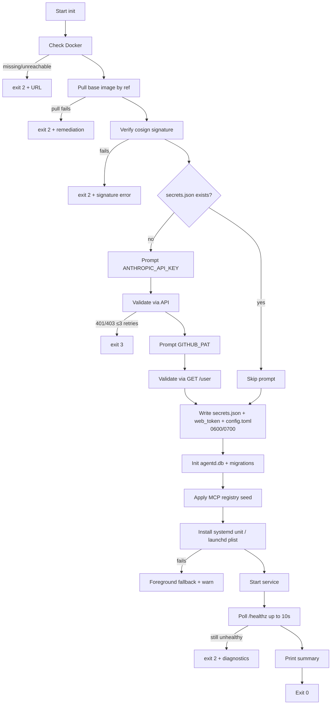

# Install, update, doctor

## 1. Distribution

`agentctl` and `agentd` ship as a single binary (subcommand-based: the
binary inspects argv[0] and routes to either CLI or daemon entry).
Distributed via:

- macOS: Homebrew tap (`brew install agentctl/tap/agentctl`), or
  signed/notarized `.pkg`.
- Linux: `.deb` and `.rpm` for systemd distros (Ubuntu 22.04+, Debian
  bookworm+, Fedora 40+); generic `tar.gz` for "I'll put it on PATH
  myself" users.

Package post-install **does not** start the daemon or write secrets; it
only lays the binary down on PATH and creates `/etc/agentctl/` (empty,
mode `0755`) for the optional site override (§15.6). All user-state
work (`~/.config/agentctl/`, `~/.local/share/agentctl/`, system-service
units) happens in `agentctl init`, run by the developer the first time.

The Web UI SPA is embedded in the binary (`go:embed` / `include_bytes!`
equivalent), no separate asset bundle.

## 2. `agentctl init` — full flow

This is the single entry point for first-time setup. It is also
re-runnable; see §3.4 for repair semantics.

### 2.1 Phases



### 2.2 Phase-by-phase detail

1. **Check Docker.** Runs `docker info`. On non-zero or no socket: exit
   with platform-specific URL (`https://docs.docker.com/desktop/install/mac-install/`,
   `…/linux-install/`). No further action.
2. **Pull image.** Reads `config.toml` `[image].ref` (defaulted to
   `agentctl/session-base:v1` if file absent). `docker pull <ref>`.
3. **Verify signature.** `cosign verify` against the configured identity.
   Skippable via `--skip-image-verify` for offline / dev installs but
   loud-warns.
4. **Token prompts.** Only if `secrets.json` doesn't already contain the
   relevant key. `--reset-token anthropic|github` forces re-prompt for
   the specified token.
5. **Validate.** `ANTHROPIC_API_KEY`: a minimal authenticated request
   (e.g., `GET /v1/models` with the key; a 200 confirms). `GITHUB_PAT`:
   `GET /user` with `Authorization: Bearer <pat>`. Three retries each.
6. **Write secrets.** Mode `0600`, parent `0700`. If the file already
   exists with wrong perms, fix and warn (R1 error case).
7. **DB init.** Open `agentd.db` (creates if absent). Run all
   migrations.
8. **Registry seed.** Resolve seed file (user → site → embedded;
   §15.6). `INSERT OR IGNORE` into `mcp_registry`.
9. **Service install.** Linux: write `~/.config/systemd/user/agentd.service`
   (agentd.md §6.1), run `systemctl --user daemon-reload`,
   `systemctl --user enable agentd`. macOS: write the plist
   (agentd.md §6.2), `launchctl bootstrap`. Both: enable
   auto-start. On any failure: log warning, run `agentd` in
   the foreground for this session.
10. **Start service.** `systemctl --user start agentd` / `launchctl
    kickstart`. Even if service install failed, foreground mode begins
    here.
11. **Health check.** Poll `GET http://127.0.0.1:7777/healthz` (no auth
    required) for up to 10s. `ok=true` ⇒ proceed.
12. **Summary.** Print:

    ```text
    agentctl is ready.

      Service:       active (systemd --user) — auto-starts on login
      Web UI:        http://127.0.0.1:7777/ (run `agentctl ui` to open)
      Image pinned:  agentctl/session-base:v1@sha256:abcd…
      MCPs:          github (default), internal-jira

    Next: agentctl start --repo <git-url>
    ```

### 2.3 Idempotency

Re-running `agentctl init` (no flags) should be a fast no-op when the
install is healthy:

- Docker check: re-run; cheap.
- Image pull: skip if `pinned_digest` matches the configured ref's
  current digest.
- Signature verify: skip if cached verification is fresh (24h).
- Tokens: not re-prompted unless missing or `--reset-token` given.
- Secrets, web_token, config: not overwritten if present and well-formed.
- DB: open + check migration version; no-op if up to date.
- Registry seed: `INSERT OR IGNORE` is naturally idempotent.
- Service unit: re-write the unit file (cheap; bytes match), reload,
  restart only if file content changed.

R1 acceptance criterion ("no duplicate MCP rows, no duplicate service
installs, no token re-prompt") is met by these rules.

## 3. `agentctl init --repair`

Repair re-runs the install steps that don't depend on tokens, idempotent
and aimed at fixing common drifts:

- Re-write the system service unit (in case of a manual edit).
- Reload + restart the service.
- Re-verify file perms on `~/.config/agentctl/*`.
- Re-apply registry seed (`INSERT OR IGNORE` only — never delete user
  edits).
- Run pending migrations.
- Re-pull the pinned image (so a wiped Docker cache is restored).
- Run `agentctl doctor` at the end.

It does **not** re-prompt for tokens. Use `--reset-token` for that.

## 4. `agentctl update`

The image-and-skill update flow. CLI only — Web UI does not initiate
updates in v1.

### 4.1 Default flow

```text
$ agentctl update
Pulling agentctl/session-base:v1 …
  pulled sha256:cafe…  (was sha256:abcd…)
Verifying signature … ok
Pinning new digest in ~/.config/agentctl/config.toml.

3 sessions exist:
  sess_01JFZ…  "auth-refactor"   running  on sha256:abcd…  (will pick up new image after next restart)
  sess_01JG0…  "lint-cleanup"    stopped  on sha256:abcd…  (will pick up new image on next resume)
  sess_01JG2…  "old-experiment"  terminated                (no action)

Run `agentctl restart <session>` to upgrade running sessions, or wait
until they idle-stop and resume.
```

Effects:

- `config.toml` `[image].pinned_digest` ← new digest.
- `[image].previous_digest` ← what `pinned_digest` was before.
- The `sessions.image_digest` column on each session is **not** changed;
  it tracks the digest the running container was created from.

### 4.2 Variants

- `agentctl update --report` — same per-session table, no pull.
- `agentctl update --rollback` — swap `pinned_digest` and
  `previous_digest`. Same staleness report.
- `agentctl update --restart-stopped` — same as default plus run
  `RestartSession` on every `stopped` row. Useful before a long
  weekend so all sessions resume on the new image.
- `agentctl update --gc` — *post-v1.* Image GC of unreferenced digests.

### 4.3 What agentd does

`agentctl update` is a CLI-orchestrated flow that issues these calls to
agentd:

1. `Update{ref, dry_run}` → returns the resolved digest and the per-session
   staleness report. agentd does the `docker pull` (so it runs as the
   service user with Docker privileges). The CLI displays the result.
2. The CLI then asks for confirmation if `--restart-stopped` was given
   and issues `RestartSession{session_id}` per row.
3. agentd updates `config.toml` `[image].pinned_digest` only on
   confirmation.

`agentctl restart <session>` is a separate command:

1. Confirms with the user (especially if `running`).
2. `Interrupt` (if needed).
3. agentd: `docker stop+rm`, recreate from new pinned digest,
   re-attach.
4. Returns when `runtime.ready` is observed.

### 4.4 Skills

Skills ride along inside the image. After `RestartSession`, `agentd`
re-fetches the skills manifest from the new container and emits
`skills.changed` so attached clients refresh their `/help` and
autocomplete.

### 4.5 The agentctl CLI / agentd binary upgrade

Out of scope for `agentctl update` in v1. The developer's package
manager (Homebrew, apt) handles binary upgrades. Once a newer binary is
installed:

- The package post-install does **not** restart `agentd`. The developer
  runs `agentctl init --repair` (idempotent) which re-stamps the
  system service unit and restarts.
- If the new binary needs a schema migration, `agentd` applies it on
  next start (data-model.md §3).
- If the binary is **older** than the on-disk DB schema (downgrade),
  `agentd` refuses to start; the developer is told what version to
  install.

## 5. `agentctl doctor`

Diagnoses install and connectivity issues. Exit code 0 if all checks
pass; non-zero per check failure (encoded as a bitmask in the exit code
for scripting).

### 5.1 Checks

| Check | What it verifies | Failure surfaces |
|---|---|---|
| `bin.versions` | agentctl, agentd, image versions consistent. | "agentctl 0.2 talking to agentd 0.1; run `init --repair`." |
| `fs.perms` | secrets.json 0600, web_token 0600, ~/.config/agentctl 0700, ~/.local/share/agentctl 0700. | Lists offending paths. |
| `db.integrity` | `PRAGMA integrity_check`; reports schema_version. | Suggests `--repair-db`. |
| `service.active` | systemd `is-active` / launchctl `print` matches expected. | Runs the install fix on `--repair`. |
| `agentd.health` | `GET /healthz` returns ok=true. | "agentd unreachable; check journal." |
| `docker.reachable` | `docker info` ok. | Platform-specific URL. |
| `docker.api` | `agentd` can list containers under its label. | "agentd lacks Docker access; check group membership." |
| `image.present` | Pinned digest exists locally. | "image missing; run `init --repair`." |
| `image.signed` | cosign verify ok against pinned digest. | "signature mismatch; possible registry compromise." |
| `mcp.registry` | mcp_registry rows are well-formed. | Per-row errors. |
| `secrets.fresh` | Anthropic key + GitHub PAT still validate. | Suggests `--reset-token`. |
| `network.policy` | Self-test container on a fresh session network: egress to anth ok; egress to peer denied; egress to host gw:7777 denied. | Per-rule pass/fail. |
| `volumes.disk` | < 80% partition usage and < 100 sessions. | Lists biggest sessions. |

### 5.2 Subcommands

- `agentctl doctor` — run all checks, print a tabular report.
- `agentctl doctor --fix` — alias for `init --repair` plus permissions
  fix.
- `agentctl doctor --repair-db` — run sqlite `VACUUM`; if integrity
  check fails, abort and tell the user to restore from backup (R6 error
  case: "DB corruption → refuse to start until repaired").
- `agentctl doctor --json` — machine-readable output for scripting.

### 5.3 Self-test container

For `network.policy`, doctor spins up a small test container on a
brand-new ephemeral session network with the same iptables rules as a
real session. It runs an embedded probe binary that reports back via
the control sock:

- `curl -s -m 3 https://api.anthropic.com/` → expect 4xx (auth-required) — proves reachability.
- `curl -s -m 3 http://<host-bridge>:7777/` → expect timeout — proves blocked.
- `curl -s -m 3 http://<peer-net-ip>:80/` (synthesizes a peer-like target) → expect timeout.

If the test fails, doctor surfaces the offending check and refuses to
declare the install healthy. This is the same self-test agentd runs at
each `Health=ok` boundary on Linux (container-and-image.md §4.1).

## 6. Failure-mode reference

Cross-references R1 error cases with implementation behavior.

| Failure | Behavior | Exit | Where |
|---|---|---|---|
| Docker missing | Print URL, exit 2 | 2 | init step 1 |
| Anthropic key invalid | Re-prompt ≤3, exit 3 | 3 | init step 5 |
| GitHub PAT invalid | Re-prompt ≤3, exit 3 | 3 | init step 5 |
| Service install fails | Foreground fallback + warn | 0 (warn) | init step 9 |
| `~/.config/agentctl` wrong perms | Fix to 0700/0600 + warn | 0 (warn) | init step 6 |
| `~/.config/agentctl/web_token` corrupted (zero bytes) | Regenerate, log warning | 0 | init step 6 |
| Image pull fails (network) | Print remediation, exit 2 | 2 | init step 2 |
| Image signature mismatch | Print signature info, exit 2 | 2 | init step 3 |
| `agentd` healthy but failing checks (`Health.ok=false`) | Print structured error pointing to `agentctl doctor` | 4 | start step (R1) |
| DB schema newer than binary | Refuse to start; print upgrade instructions | n/a | agentd boot |
| DB integrity check fails | `agentctl doctor --repair-db` required | 5 | agentd boot |

All failures emit a structured event into `~/.local/state/agentctl/last-error.log`
that doctor reads to give a coherent recap.
