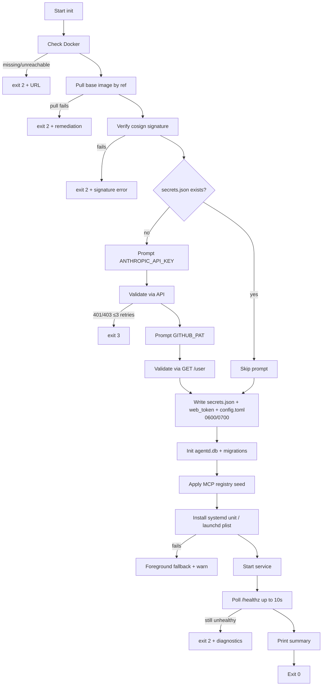

# Install, update, doctor

## 1. Distribution

`agentctl` and `agentd` ship as a single binary (subcommand-based: the
binary inspects `argv[0]` and routes to either CLI or daemon entry).
The Web UI SPA is embedded in the binary (`go:embed` / `include_bytes!`
equivalent), so there is no separate asset bundle.

### 1.1 Canonical install path: `install.sh`

The supported install path is a one-line shell command, modeled on
Claude Code's installer:

```bash
curl -fsSL https://install.agentctl.dev/install.sh | bash
```

A pinned version is also supported:

```bash
curl -fsSL https://install.agentctl.dev/install.sh | AGENTCTL_VERSION=v0.2.3 bash
```

The script is hosted at the URL above (CNAME to GitHub Pages or an S3
static site backing the GitHub Releases binaries). It is the same
script for macOS and Linux.

### 1.2 What `install.sh` does

1. Detect host: OS in {`linux`, `darwin`}, arch in {`amd64`, `arm64`}.
   Refuse on anything else with a clear message.
2. Resolve target version: `AGENTCTL_VERSION` env var, else "latest"
   from the GitHub Releases API.
3. Download `agentctl-<version>-<os>-<arch>.tar.gz` and the matching
   `.sha256` and `.minisig` (or `.cosign.bundle`) from GitHub Releases.
4. Verify the SHA256 and the signature against an embedded public key
   baked into the script. Abort on mismatch — never run an unverified
   binary.
5. Extract to `${INSTALL_DIR:-$HOME/.local/bin}/agentctl`, `chmod +x`.
6. If the install dir is not on `PATH`, print the exact `export PATH=…`
   line for the user's shell.
7. Write `~/.local/share/agentctl/install_metadata.json`
   (version, install method, install timestamp, source URL) so
   `agentctl doctor` and a future self-update path can introspect.
8. Print:
   ```
   agentctl <version> installed.
   Next: agentctl init
   ```

The script does **not**:
- start `agentd`,
- write secrets,
- install the system-service unit,
- prompt for anything.

All of that is `agentctl init`'s job (§2). This separation keeps the
installer non-interactive — safe to run from CI, dotfiles, provisioning
tools — and keeps `init` the single place that touches user state.

### 1.3 Environment variables honoured by `install.sh`

| Var | Purpose | Default |
|---|---|---|
| `AGENTCTL_VERSION` | Pin to a specific release tag. | latest |
| `INSTALL_DIR` | Where to drop the binary. | `$HOME/.local/bin` |
| `AGENTCTL_INSTALL_NO_VERIFY` | Skip signature verification. Loud-warns; intended only for offline mirror setups. | unset (verification on) |
| `AGENTCTL_DOWNLOAD_BASE` | Override the release host (private mirror, air-gapped install). | `https://github.com/<org>/agentctl/releases/download` |

### 1.4 Idempotency and upgrade

Re-running `install.sh` against an existing install:

- If the resolved version matches the on-disk version, no-op (prints
  "agentctl <v> already installed").
- Otherwise: download new version, verify, atomically replace the
  binary (`install.sh` writes to `agentctl.new`, then `mv` over the
  old). The next invocation of `agentctl` picks up the new binary.
- The system-service unit is **not** restarted by `install.sh`. The
  developer runs `agentctl init --repair` (which restarts `agentd`)
  after a binary upgrade to apply any unit-file changes and pick up
  the new daemon. A future v1.1 can wire `agentctl self-update` as a
  thin wrapper that does both.

So "re-run `install.sh`" is the v1 self-update story. Native
`agentctl self-update` (no curl pipe) remains a v2 candidate
(`v2-requirements.md`).

### 1.5 Uninstall

```bash
curl -fsSL https://install.agentctl.dev/install.sh | bash -s -- --uninstall
```

Removes `${INSTALL_DIR}/agentctl`, the system-service unit (`systemctl
--user disable --now agentd` / `launchctl bootout`), and prints the
paths to `~/.config/agentctl/` and `~/.local/share/agentctl/` for the
developer to remove manually if they want a clean wipe. We do **not**
auto-remove user data; volumes may contain working code.

### 1.6 Why not native packages

Native packages (Homebrew tap, `.deb`, `.rpm`, `.pkg`) were considered
and dropped from v1:

- Five distribution channels = five test matrices, five release
  pipelines, and five places for the install story to drift.
- A single signed-binary tarball pulled by a tiny shell script
  is portable across every Linux distro and macOS version we
  support, with no per-distro packaging metadata.
- The signature-verified `install.sh` is the same security posture as
  signed package metadata, without the package-manager indirection.

If post-v1 demand exists for `brew install agentctl` (developer-tool
ergonomics) we add the Homebrew tap as an additional channel; the
binary doesn't change. Same for `.deb` / `.rpm` if a customer needs
unattended provisioning via apt/dnf.

### 1.7 What the install script lays down

After `install.sh` runs successfully, the developer's machine has:

- `${INSTALL_DIR}/agentctl` — the binary.
- `~/.local/share/agentctl/install_metadata.json` — install
  bookkeeping.

That's it. No system-service unit, no config, no secrets, no DB —
those land in `agentctl init` (§2).

## 2. `agentctl init` — full flow

This is the single entry point for first-time setup. It is also
re-runnable; see §3.4 for repair semantics.

### 2.1 Phases



### 2.2 Phase-by-phase detail

1. **Check Docker.** Runs `docker info`. On non-zero or no socket: exit
   with platform-specific URL (`https://docs.docker.com/desktop/install/mac-install/`,
   `…/linux-install/`). No further action.
2. **Pull image.** Reads `config.toml` `[image].ref` (defaulted to
   `agentctl/session-base:v1` if file absent). `docker pull <ref>`.
3. **Verify signature.** `cosign verify` against the configured identity.
   Skippable via `--skip-image-verify` for offline / dev installs but
   loud-warns.
4. **Token prompts.** Only if `secrets.json` doesn't already contain the
   relevant key. `--reset-token anthropic|github` forces re-prompt for
   the specified token.
5. **Validate.** `ANTHROPIC_API_KEY`: a minimal authenticated request
   (e.g., `GET /v1/models` with the key; a 200 confirms). `GITHUB_PAT`:
   `GET /user` with `Authorization: Bearer <pat>`. Three retries each.
6. **Write secrets.** Mode `0600`, parent `0700`. If the file already
   exists with wrong perms, fix and warn (R1 error case).
7. **DB init.** Open `agentd.db` (creates if absent). Run all
   migrations.
8. **Registry seed.** Resolve seed file (user → site → embedded;
   §15.6). `INSERT OR IGNORE` into `mcp_registry`.
9. **Service install.** Linux: write `~/.config/systemd/user/agentd.service`
   (agentd.md §6.1), run `systemctl --user daemon-reload`,
   `systemctl --user enable agentd`. macOS: write the plist
   (agentd.md §6.2), `launchctl bootstrap`. Both: enable
   auto-start. On any failure: log warning, run `agentd` in
   the foreground for this session.
10. **Start service.** `systemctl --user start agentd` / `launchctl
    kickstart`. Even if service install failed, foreground mode begins
    here.
11. **Health check.** Poll `GET http://127.0.0.1:7777/healthz` (no auth
    required) for up to 10s. `ok=true` ⇒ proceed.
12. **Summary.** Print:

    ```text
    agentctl is ready.

      Service:       active (systemd --user) — auto-starts on login
      Web UI:        http://127.0.0.1:7777/ (run `agentctl ui` to open)
      Image pinned:  agentctl/session-base:v1@sha256:abcd…
      MCPs:          github (default), internal-jira

    Next: agentctl start --repo <git-url>
    ```

### 2.3 Idempotency

Re-running `agentctl init` (no flags) should be a fast no-op when the
install is healthy:

- Docker check: re-run; cheap.
- Image pull: skip if `pinned_digest` matches the configured ref's
  current digest.
- Signature verify: skip if cached verification is fresh (24h).
- Tokens: not re-prompted unless missing or `--reset-token` given.
- Secrets, web_token, config: not overwritten if present and well-formed.
- DB: open + check migration version; no-op if up to date.
- Registry seed: `INSERT OR IGNORE` is naturally idempotent.
- Service unit: re-write the unit file (cheap; bytes match), reload,
  restart only if file content changed.

R1 acceptance criterion ("no duplicate MCP rows, no duplicate service
installs, no token re-prompt") is met by these rules.

## 3. `agentctl init --repair`

Repair re-runs the install steps that don't depend on tokens, idempotent
and aimed at fixing common drifts:

- Re-write the system service unit (in case of a manual edit).
- Reload + restart the service.
- Re-verify file perms on `~/.config/agentctl/*`.
- Re-apply registry seed (`INSERT OR IGNORE` only — never delete user
  edits).
- Run pending migrations.
- Re-pull the pinned image (so a wiped Docker cache is restored).
- Run `agentctl doctor` at the end.

It does **not** re-prompt for tokens. Use `--reset-token` for that.

## 4. `agentctl update`

The image-and-skill update flow. CLI only — Web UI does not initiate
updates in v1.

### 4.1 Default flow

```text
$ agentctl update
Pulling agentctl/session-base:v1 …
  pulled sha256:cafe…  (was sha256:abcd…)
Verifying signature … ok
Pinning new digest in ~/.config/agentctl/config.toml.

3 sessions exist:
  sess_01JFZ…  "auth-refactor"   running  on sha256:abcd…  (will pick up new image after next restart)
  sess_01JG0…  "lint-cleanup"    stopped  on sha256:abcd…  (will pick up new image on next resume)
  sess_01JG2…  "old-experiment"  terminated                (no action)

Run `agentctl restart <session>` to upgrade running sessions, or wait
until they idle-stop and resume.
```

Effects:

- `config.toml` `[image].pinned_digest` ← new digest.
- `[image].previous_digest` ← what `pinned_digest` was before.
- The `sessions.image_digest` column on each session is **not** changed;
  it tracks the digest the running container was created from.

### 4.2 Variants

- `agentctl update --report` — same per-session table, no pull.
- `agentctl update --rollback` — swap `pinned_digest` and
  `previous_digest`. Same staleness report.
- `agentctl update --restart-stopped` — same as default plus run
  `RestartSession` on every `stopped` row. Useful before a long
  weekend so all sessions resume on the new image.
- `agentctl update --gc` — *post-v1.* Image GC of unreferenced digests.

### 4.3 What agentd does

`agentctl update` is a CLI-orchestrated flow that issues these calls to
agentd:

1. `Update{ref, dry_run}` → returns the resolved digest and the per-session
   staleness report. agentd does the `docker pull` (so it runs as the
   service user with Docker privileges). The CLI displays the result.
2. The CLI then asks for confirmation if `--restart-stopped` was given
   and issues `RestartSession{session_id}` per row.
3. agentd updates `config.toml` `[image].pinned_digest` only on
   confirmation.

`agentctl restart <session>` is a separate command:

1. Confirms with the user (especially if `running`).
2. `Interrupt` (if needed).
3. agentd: `docker stop+rm`, recreate from new pinned digest,
   re-attach.
4. Returns when `runtime.ready` is observed.

### 4.4 Skills

Skills ride along inside the image. After `RestartSession`, `agentd`
re-fetches the skills manifest from the new container and emits
`skills.changed` so attached clients refresh their `/help` and
autocomplete.

### 4.5 The agentctl CLI / agentd binary upgrade

`agentctl update` covers only the **base image**, not the binary. To
upgrade the binary, the developer re-runs `install.sh` (§1.4):

```bash
curl -fsSL https://install.agentctl.dev/install.sh | bash
```

The script detects an existing install, downloads the newer release,
verifies the signature, and atomically replaces the binary. After the
binary is replaced:

- The new binary is on PATH the next time the developer invokes
  `agentctl`.
- The running `agentd` is **not** restarted by `install.sh`. The
  developer runs `agentctl init --repair` (idempotent) which re-stamps
  the system-service unit (in case it changed) and restarts the
  daemon.
- If the new binary ships a DB schema migration, `agentd` applies it
  on next start (data-model.md §3).
- If the binary is **older** than the on-disk DB schema (downgrade),
  `agentd` refuses to start with `error{code: "schema_too_new"}`; the
  developer is told the minimum version to install.

A native `agentctl self-update` subcommand that wraps "download new
binary + verify + replace + restart" without curl-piping is a v2
candidate (`v2-requirements.md`).

## 5. `agentctl doctor`

Diagnoses install and connectivity issues. Exit code 0 if all checks
pass; non-zero per check failure (encoded as a bitmask in the exit code
for scripting).

### 5.1 Checks

| Check | What it verifies | Failure surfaces |
|---|---|---|
| `bin.versions` | agentctl, agentd, image versions consistent. | "agentctl 0.2 talking to agentd 0.1; run `init --repair`." |
| `fs.perms` | secrets.json 0600, web_token 0600, ~/.config/agentctl 0700, ~/.local/share/agentctl 0700. | Lists offending paths. |
| `db.integrity` | `PRAGMA integrity_check`; reports schema_version. | Suggests `--repair-db`. |
| `service.active` | systemd `is-active` / launchctl `print` matches expected. | Runs the install fix on `--repair`. |
| `agentd.health` | `GET /healthz` returns ok=true. | "agentd unreachable; check journal." |
| `docker.reachable` | `docker info` ok. | Platform-specific URL. |
| `docker.api` | `agentd` can list containers under its label. | "agentd lacks Docker access; check group membership." |
| `image.present` | Pinned digest exists locally. | "image missing; run `init --repair`." |
| `image.signed` | cosign verify ok against pinned digest. | "signature mismatch; possible registry compromise." |
| `mcp.registry` | mcp_registry rows are well-formed. | Per-row errors. |
| `secrets.fresh` | Anthropic key + GitHub PAT still validate. | Suggests `--reset-token`. |
| `network.peer_isolation` | Spin up two ephemeral diagnostic containers on two session networks; verify each is unable to reach the other. (Egress filtering is not enforced in v1; see `v2-requirements.md` §V2.1.) | Per-test pass/fail. |
| `volumes.disk` | < 80% partition usage and < 100 sessions. | Lists biggest sessions. |

### 5.2 Subcommands

- `agentctl doctor` — run all checks, print a tabular report.
- `agentctl doctor --fix` — alias for `init --repair` plus permissions
  fix.
- `agentctl doctor --repair-db` — run sqlite `VACUUM`; if integrity
  check fails, abort and tell the user to restore from backup (R6 error
  case: "DB corruption → refuse to start until repaired").
- `agentctl doctor --json` — machine-readable output for scripting.

### 5.3 Peer-isolation self-test

For `network.peer_isolation`, doctor spins up two small probe
containers on two distinct ephemeral session networks (matching the
real session network config: `enable_icc=false`). Probe A tries to
reach probe B on its bridge IP and expects a connect timeout. Both
probes report back via their bind-mounted control socks.

If the test fails, doctor surfaces it and refuses to declare the
install healthy. v1 does **not** test outbound egress restrictions
because v1 does not enforce them — see `v2-requirements.md` §V2.1.

## 6. Failure-mode reference

Cross-references R1 error cases with implementation behavior.

| Failure | Behavior | Exit | Where |
|---|---|---|---|
| Docker missing | Print URL, exit 2 | 2 | init step 1 |
| Anthropic key invalid | Re-prompt ≤3, exit 3 | 3 | init step 5 |
| GitHub PAT invalid | Re-prompt ≤3, exit 3 | 3 | init step 5 |
| Service install fails | Foreground fallback + warn | 0 (warn) | init step 9 |
| `~/.config/agentctl` wrong perms | Fix to 0700/0600 + warn | 0 (warn) | init step 6 |
| `~/.config/agentctl/web_token` corrupted (zero bytes) | Regenerate, log warning | 0 | init step 6 |
| Image pull fails (network) | Print remediation, exit 2 | 2 | init step 2 |
| Image signature mismatch | Print signature info, exit 2 | 2 | init step 3 |
| `agentd` healthy but failing checks (`Health.ok=false`) | Print structured error pointing to `agentctl doctor` | 4 | start step (R1) |
| Peer-isolation self-test fails | Surface offending pair; refuse `doctor` healthy | 5 | doctor `network.peer_isolation` |
| DB schema newer than binary | Refuse to start; print upgrade instructions | n/a | agentd boot |
| DB integrity check fails | `agentctl doctor --repair-db` required | 5 | agentd boot |

All failures emit a structured event into `~/.local/state/agentctl/last-error.log`
that doctor reads to give a coherent recap.
