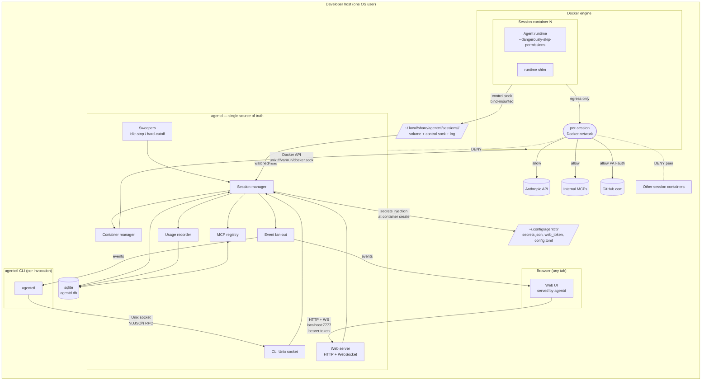
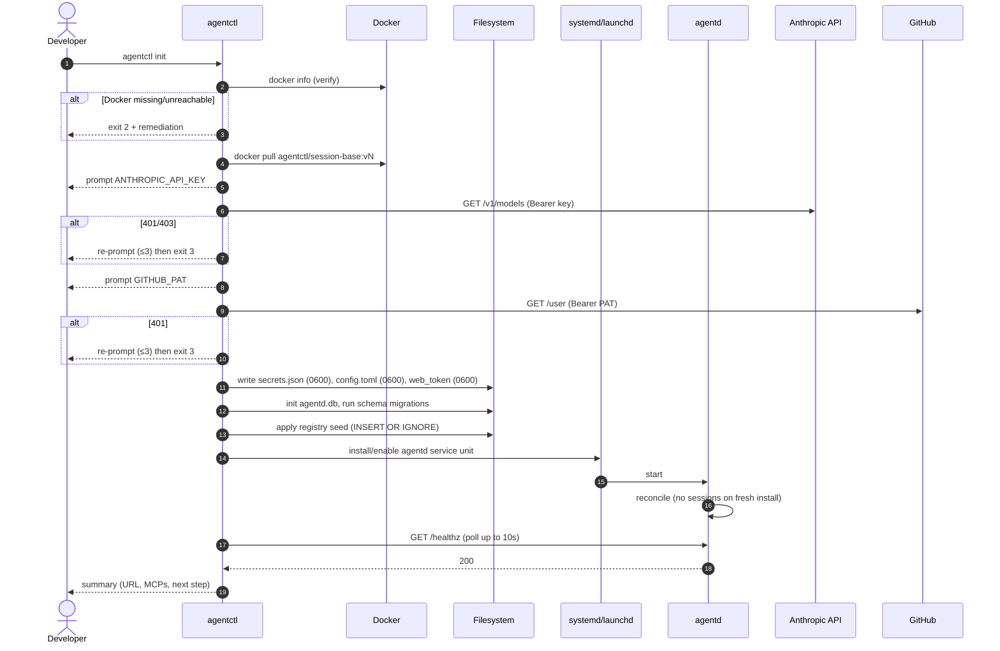
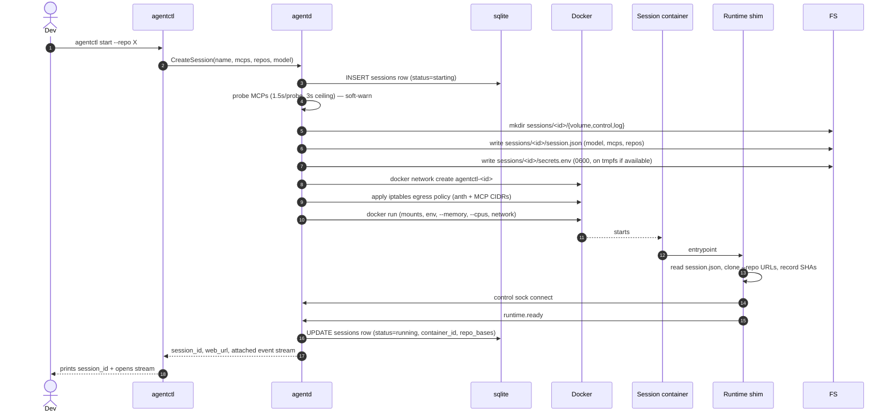
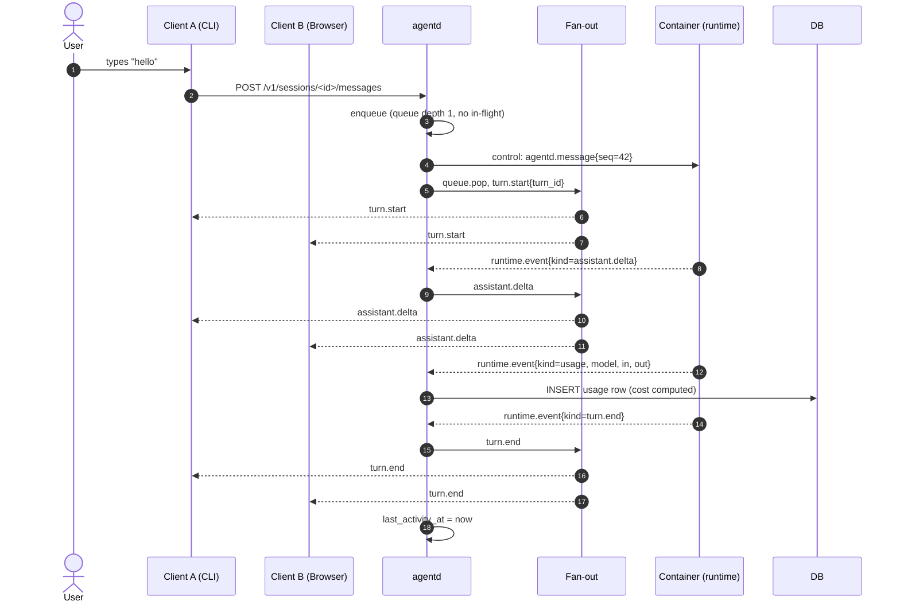
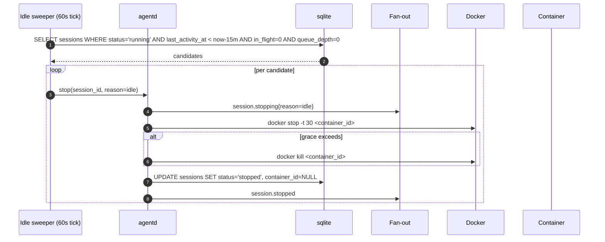
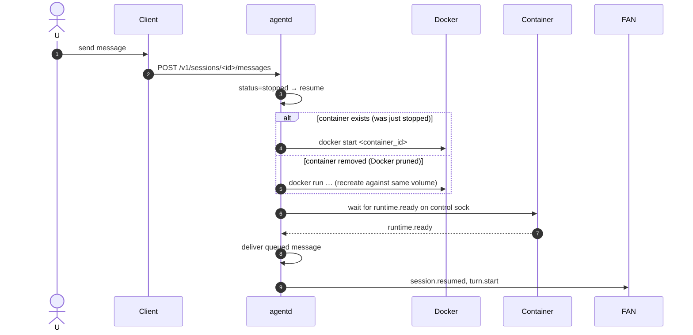
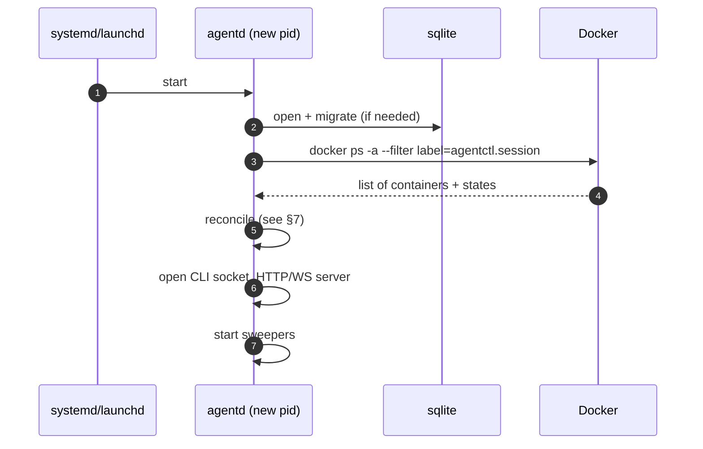
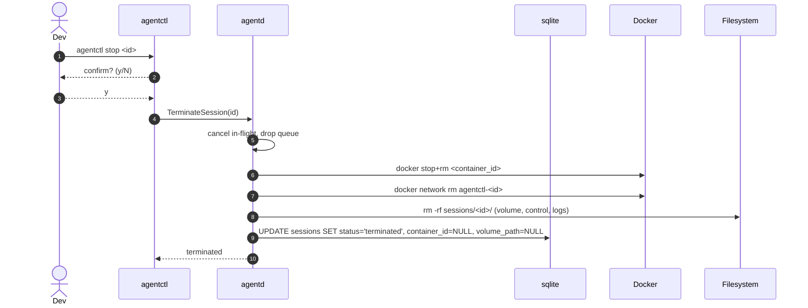

# agentctl v1 — architecture overview

This document is the entry point to the v1 architecture. Read it first; the
sibling docs go deeper on specific surfaces.

| Doc | Covers |
|---|---|
| `overview.md` (this file) | System shape, lifecycles, principles, recovery algorithm. |
| `api.md` | Wire protocols on every channel: CLI ↔ agentd, browser ↔ agentd, container ↔ agentd. |
| `data-model.md` | sqlite schema, on-disk layout, migrations. |
| `container-and-image.md` | Base image, container creation params, network policy. |
| `agentd.md` | Daemon module breakdown, concurrency, service unit. |
| `install-and-update.md` | `init`, `update`, `doctor`, `repair`. |
| `observability.md` | Logging, metrics, what `agentctl logs` tails. |
| `security.md` | Threat model, secrets, network, web auth. |
| `phasing.md` | Five milestones to v1 GA. |
| `decisions/` | ADRs (one per resolved §15 question + significant own choices). |

## 1. Mental model

`agentd` is a **per-user host daemon** that owns sessions. Everything else is
a client of it.

- A **session** is a row in `agentd.db`, a directory in
  `~/.local/share/agentctl/sessions/<id>/`, and at most one Docker container.
- A **client** (CLI process or browser tab) is a stateless consumer of
  `agentd`. Clients hold no session state across reconnects.
- A **session container** runs the agent runtime (Claude Code) with permission
  prompting disabled (§15.1). Its only inbound channel from outside is a
  bind-mounted Unix domain socket connecting it to `agentd`. Its only
  outbound network access is the per-session Docker network policy in R7.

The only persistent state for a session is:

1. The session row (in sqlite) — metadata and bookkeeping owned by `agentd`.
2. The session volume on disk — owned by the runtime; conversation history,
   working tree, repo clones, scratch.
3. The cost rows in `usage` (in sqlite) — outlive the session.

Container memory is ephemeral. The session is reconstructable any time from
1+2 by starting a new container against the same volume.

## 2. Component diagram



What is **not** in v1 (per §16): remote agentd, multi-user, cloud-hosted
sessions, host bind-mounts of source trees, container pause state, hardened
sandboxes beyond Docker.

## 3. Trust boundaries

| Boundary | Trust |
|---|---|
| `agentctl` CLI ↔ `agentd` Unix socket | Trusted: same OS user. Socket file mode `0600`. |
| Browser ↔ `agentd` HTTP/WS | Half-trusted: same machine, but any local process under the same user can reach `127.0.0.1:7777`. Bearer token + Origin check required (§15.7). |
| Session container ↔ `agentd` control socket | Untrusted from `agentd`'s side. The container is the agent's blast radius (§15.1). Messages are validated, rate-limited, and never include host paths. |
| Session container ↔ another session container | No trust, no path. Per-session Docker network blocks peer access (R7). |
| Session container ↔ host loopback | No trust, no path. Network policy denies the Docker gateway IP for everything except Anthropic + configured MCP CIDRs. The control socket bind-mount is the only host-side surface. |
| `agentd` ↔ Docker daemon | `agentd` is trusted by the Docker daemon (membership in the `docker` group on Linux, same-user on macOS). This is the same trust the developer already grants `docker` CLI usage. |
| `agentd` ↔ disk (`~/.config`, `~/.local/share`) | `agentd` enforces `0600`/`0700` perms. Anything else under those paths is a doctor-flagged anomaly. |

## 4. Where things run

| Process | Lifetime | Bound to | Owns |
|---|---|---|---|
| `agentd` | Boot until logout/reboot. Restarts via systemd `--user` / launchd. | Unix socket `~/.local/share/agentctl/agentd.sock` (`0600`); HTTP/WS `127.0.0.1:7777`. | sqlite, MCP registry, container lifecycle, event fan-out, sweepers. |
| `agentctl` CLI | One process per invocation. | Connects to the Unix socket; never listens. | Nothing persistent. |
| Web UI assets | Embedded in the `agentd` binary; served by it. | N/A | UI state lives only in browser memory + a `agentctl_token` cookie. |
| Session container | While `running`. Recreated on resume after stop. | Per-session Docker network; bind-mount of the session volume + control socket dir. | Conversation history, working dir, scratch. |
| Runtime shim (in container) | Container lifetime. | Connects to the bind-mounted control socket. | Bridges runtime stdio to the agentd channel; clones `--repo` URLs at start. |

## 5. Architecture principles compliance

The principles in §3 of `requirements.md` are non-negotiable. How each is met:

| Principle | How v1 honors it |
|---|---|
| `agentd` is the single source of truth | Session lifecycle, queue, MCP registry, cost, and event ordering all live in `agentd`. Clients are stateless. |
| Containers do not self-manage | The runtime shim initiates no lifecycle calls. Idle-stop, hard-cutoff, and recovery are all `agentd`'s decisions. The shim only relays runtime events and accepts `agentd` commands. |
| CLI and Web UI are peers | A single internal API (§api.md §1) is exposed over both Unix socket (NDJSON RPC) and HTTP+WS. Surfaces are 1:1. |
| Local-only by default | `agentd` binds `127.0.0.1` only. No outbound calls (Anthropic / GitHub) come from `agentd`; only the container makes them, and only the container is on the public internet path. |
| One developer per machine | All paths under `$HOME`. No shared state. |
| Deterministic startup | systemd `--user` / launchd auto-start at login. On startup, `agentd` reconciles DB ↔ Docker (§7) before accepting any client. |

## 6. Lifecycle sequence diagrams

Each diagram is the canonical view of that flow. Wire-level details are in
`api.md`; container details are in `container-and-image.md`.

### 6.1 Install (`agentctl init`)



Failure modes: §install-and-update.md §3.

### 6.2 Session start



Cold-start budget: §4 of requirements (≤5s p50). The image is assumed cached;
`docker run` + shim init dominate.

### 6.3 Message round-trip with two attached clients



A second message sent by C2 while a turn is in flight is queued (§15.4) and
broadcast as `queue.depth=2` to both clients. An explicit `Interrupt` is the
only thing that cancels the in-flight turn.

### 6.4 Idle-stop



Note: `in_flight` and `queue_depth` are computed live; if either is nonzero
the sweeper skips. The hard-cutoff sweeper (24 h default) does **not** skip —
it cancels the in-flight turn first, then stops.

### 6.5 Idle-resume



Resume preserves the volume; the runtime re-reads its history from
`/work/.history/` (the runtime owns that path; `agentd` does not parse it).

### 6.6 agentd restart recovery



Crucially: `agentd` reconstructs in-memory state from sqlite + Docker, never
from clients. Clients reconnect on the new socket and rebuild their view.

### 6.7 Host reboot recovery

Same as §6.6 plus the systemd/launchd auto-start. After Docker comes up
(systemd ordering: `agentd.service` has `After=docker.service`; on macOS
launchd lacks Docker ordering, so `agentd` retries Docker connectivity for
up to 60s before going `degraded`).

### 6.8 End of session



`usage` rows are kept (R10). The `sessions` row stays as `terminated` so
`agentctl cost <id>` still works historically.

## 7. agentd startup reconciliation algorithm

Run **before** opening the CLI socket or HTTP/WS port (so no client sees
mid-reconcile state).

```text
input:  rows  = SELECT * FROM sessions WHERE status IN ('starting','running','stopped')
        ctnrs = docker ps -a --filter label=agentctl.session={row.id}, for all rows

for each row in rows:
    label_match = ctnrs[row.id]   # may be missing

    case row.status:
      'starting':
        # Crash mid-create. The container may or may not exist.
        if label_match exists:
          docker rm -f label_match     # clean up partial container
        UPDATE sessions SET status='stopped',
                            container_id=NULL,
                            last_error='aborted_during_create_<ts>'
        # User's next message will recreate.

      'running':
        if label_match exists and label_match.state == 'running':
          # Real running container survives daemon restart
          adopt(row, label_match)      # re-attach to control sock
          if adopt fails (sock gone, runtime not ready):
            docker stop+rm label_match
            UPDATE sessions SET status='stopped'
        else if label_match exists and label_match.state in ('exited','dead'):
          # Container exited while we were down
          UPDATE sessions SET status='stopped'
          (optionally) docker rm label_match
        else:
          # Container vanished entirely (docker prune, manual rm, etc.)
          UPDATE sessions SET status='stopped',
                              container_id=NULL,
                              last_error='container_missing_at_recovery'

      'stopped':
        if label_match exists and label_match.state == 'running':
          # Should not happen, but tolerate. Reattach.
          adopt(row, label_match)
          UPDATE sessions SET status='running'
        else:
          # Expected. No-op.
          pass

remove orphan containers: any docker container with label
  agentctl.session=<id> where row not in ('running','stopped','starting')
  → docker rm -f.

remove orphan networks: any docker network agentctl-<id> with no row in
  ('running','stopped','starting') → docker network rm.

remove orphan volume dirs: any sessions/<id>/ on disk with no DB row
  → MOVE to sessions/.orphans/<id>-<ts>/ for manual review (never delete
  user data without an explicit row to anchor on).
```

`adopt()` is the only step that talks to the container. It connects to the
bind-mounted control socket and issues a `runtime.ping` with a 2s timeout.
Pong → adopted. Timeout → treat as dead and stop.

Sweepers and sessions are not started until reconcile completes. The HTTP
server returns `503 reconciling` during this window and `agentctl` retries.

## 8. Non-functional targets — feasibility

| Target | Plan | Risk |
|---|---|---|
| Cold start ≤5s p50, ≤10s p99 | `docker run` + shim ready typically lands in 1–3s with a cached image. Repo cloning is bounded by `--repo` count. | Repo clones can blow the budget on slow networks; we measure shim-ready, not repos-ready, against the budget. Repo clone is a separate progress event. |
| Idle resume same | `docker start` against an existing container is sub-second; shim ready ~500ms. | Sometimes Docker has pruned the container; recreation path matches cold-start budget. |
| RT overhead ≤50ms p99 | Single Unix-socket hop CLI→agentd→container. agentd is in-process Go/Rust; control sock latency is sub-ms. | First-message-after-resume includes runtime warmup. We document this exclusion. |
| ≥10 concurrent sessions on 16 GB / 8-core | Default 4 GB / 2-core caps × 10 = 40 GB / 20 cores requested; with `--memory` not pre-allocated, real pressure is what the runtimes use. Idle containers compress well. | Eight active simultaneous turns will swap. The doc target is "10 sessions exist"; only a handful are typically active. We do not enforce admission control in v1 — `agentctl start` succeeds and Docker decides. |
| Localhost-only exposure | `agentd` listens on `127.0.0.1` and `::1` only; explicit refusal to bind anything else. | None. |
| No outbound telemetry | `agentd` makes zero outbound network calls. Only the session container does, on its dedicated network. | None. |

**Flagged risk:** the cold-start budget excludes image pull. We report this
explicitly in `agentctl start` if we observe an image-pull cycle (rare —
images are pinned and present after `init`).

## 9. Requirement-level clarifications

While reading R1–R10 we noted these ambiguities. The architecture resolves
each in a way that does not change requirement intent.

1. **R2 "container fails to start" → `error` status.** The data model in R2
   names statuses `running`, `stopped`, `terminated`. We add `starting` and
   `error` as transient/terminal states; the user-facing CLI maps them to
   `starting`/`error` columns. Documented in `data-model.md`.
2. **R3 `--repo` repo cloning point.** R3 says the runtime should be exposed
   "without any extra config." We clone repos in the runtime shim **before**
   announcing `runtime.ready` so the user's first message never races a
   half-cloned tree.
3. **R4 detach.** "`agentctl detach` (or closing the terminal) disconnects
   only that client." We implement detach client-side (close socket); the
   server only sees a disconnect. No server-side state per attached client
   beyond the live websocket.
4. **R6 event buffer size.** R6 says "last 200 or 5 minutes, whichever
   larger." We implement: a per-session ring buffer in memory (1,000-event
   cap, ~5 MB hard) plus a per-session events file on disk (`events.ndjson`
   capped at 50 MB) so reconnect-after-long-disconnect still works without
   asking the runtime to re-render.
5. **R8 working tree change visibility.** "Updates as the agent edits …
   pushed via the event stream." We expose `repo.changed` events the shim
   emits via a fsnotify watcher inside the container scoped to
   `/work/<repo>` excluding `.git/objects` to keep churn tolerable.
6. **R10 cost row insertion.** R10 says one row "per turn." We instead
   insert one row per **assistant turn end** event when the runtime emits a
   final usage block; partial deltas are not persisted. This is consistent
   with R10's worked example (N tokens at price P → one row).

These notes do not change requirement intent; they pin down implementation
points the requirements left informal.

## 10. Top three risks and mitigations

1. **Network-policy correctness.** R7 demands the container reach Anthropic
   + configured MCPs but **not** the host loopback or peer containers.
   Getting iptables rules wrong is silently easy and security-relevant.
   *Mitigation:* `agentd doctor` runs a network-policy self-test on every
   start (egress allowed to `api.anthropic.com:443`, blocked to
   `<host-gw>:7777` and to a peer container's IP). Failed self-test marks
   the session `error` rather than letting it run unsafely. See
   `container-and-image.md` §4 and `security.md` §4.

2. **Recovery edge cases.** The reconciliation algorithm (§7) is the
   critical path for "no manual intervention after reboot" (R6).
   *Mitigation:* every state transition writes to sqlite **before** issuing
   the Docker call. On replay we always have a row that says "we were
   trying to do X." Plus a battery of fault-injection tests in the v1 test
   plan (kill agentd mid-create, mid-stop, etc.) listed in `phasing.md`.

3. **Web UI auth bypass.** Local malware running as the same user can read
   `web_token` and drive the UI. We've raised the bar (token + Origin) but
   not eliminated the risk.
   *Mitigation:* document the trust boundary clearly (`security.md` §3),
   support fast token rotation (`init --reset-web-token`), and avoid
   widening UI capabilities beyond what the CLI already exposes — same
   trust model, same blast radius.

## 11. Open questions raised during architecture

These are **new** questions that surfaced while designing v1. They have
recommended defaults and are not blockers for design sign-off; they need a
product-owner call before implementation begins.

| # | Question | Recommended default |
|---|---|---|
| O1 | When a `running` session's pinned image has been replaced via `agentctl update`, should `agentctl ls` flag the staleness in its default output? | Yes — add a `*` next to the image column in `--verbose` and a banner on first attach. Non-blocking. |
| O2 | Should `agentctl logs <session>` include redacted control-channel frame metadata by default, or only on `--verbose`? | Verbose only. The default tail is `agentd`-side lifecycle and errors; frame metadata is noisy. |
| O3 | What's the right abuse posture if a container emits >100 events/sec for >10s? Drop, throttle, or session-error? | Throttle (drop rate, broadcast `runtime.throttled`); escalate to session-error if sustained >60s. |
| O4 | If the developer's `~/.config/agentctl/config.toml` is corrupt, should `agentd` refuse to start or fall back to defaults? | Refuse to start; print the offending key/line. Fall back is a silent surprise we can't undo. |
| O5 | Should the seeded GitHub MCP entry use the official `https://api.githubcopilot.com/mcp/` URL or a team-internal pinned mirror? | Embedded default uses the official URL; teams override via site/user seed (§15.6). |
