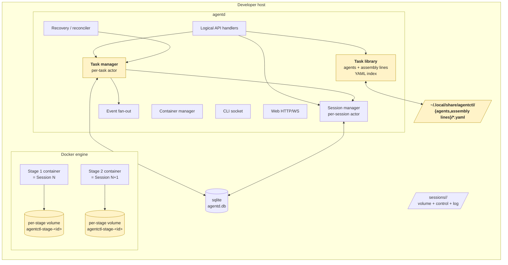
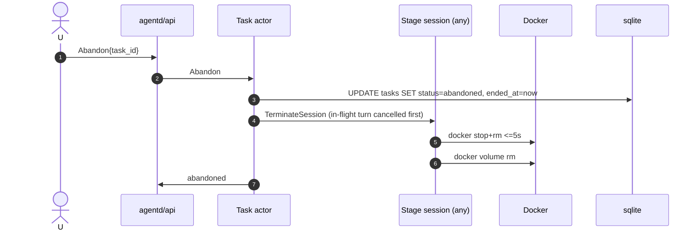

# Assembly lines & Task Management — Architecture

This document is the technical architecture pass on
`assembly-lines-task-management.md` (the v0 requirements). It maps the new
top-level objects — **Agents**, **Assembly lines**, **Tasks**, **Stages** —
onto agentctl v1's existing daemon, container, data, and API surfaces.

Read `assembly-lines-task-management.md` first; this doc references its
requirement numbers (R1–R8) verbatim. Sibling v1 architecture docs that
this one extends are listed in §13.

| Section | Covers |
|---|---|
| §1 | Mental model: how Tasks/Stages sit above Sessions. |
| §2 | Component diagram delta against v1 `overview.md` §2. |
| §3 | Lifecycle sequence diagrams (task create, handoff, abandon, recovery). |
| §4 | Data model — sqlite schema + on-disk YAML layout. |
| §5 | State machines (task, stage) — canonical transition tables. |
| §6 | Per-stage isolation: volumes, clones, file seeding. |
| §7 | Synthesis and handoff protocol. |
| §8 | API surface additions (logical ops + event kinds). |
| §9 | agentd module additions and the per-task actor. |
| §10 | Recovery / reconciliation extensions. |
| §11 | Non-functional target feasibility. |
| §12 | Open architecture questions and ADRs to write. |
| §13 | Cross-references and integration touchpoints. |

## 1. Mental model

Three layers, top-down:

```
┌─ Task ─────────────────────────────────────────────────────┐
│  assembly line + issue + repo + chat thread                     │
│                                                            │
│  ┌─ Stage 1 ─────────┐  ┌─ Stage 2 ─────────┐  ┌─ Stage 3 ┐│
│  │ agent A           │  │ agent B           │  │ agent C  ││
│  │ ─ Session ─       │  │ ─ Session ─       │  │ ─Session─││
│  │ ─ Container ─     │  │ ─ Container ─     │  │ ─Container││
│  │ ─ Volume ─        │  │ ─ Volume ─        │  │ ─Volume ─││
│  │ ─ Fresh clone ─   │  │ ─ Fresh clone ─   │  │─Fresh cln─││
│  └───────────────────┘  └───────────────────┘  └──────────┘│
└────────────────────────────────────────────────────────────┘
```

The four invariants the architecture is built around:

1. **Tasks sit above Sessions; Sessions remain the schedulable unit.**
   No code path in v1 that operates on a Session has to know about Tasks.
   The Task layer composes Sessions; it does not replace them.
2. **One stage active per task. Strict linear sequence.** The task is a
   small state machine driven by user intent (`Handoff`, `Complete`,
   `Abandon`); transitions advance one stage at a time.
3. **Per-stage isolation by construction.** Each stage is one Session,
   which already implies one container + one volume in v1. The new
   wrinkle is *the volume is per-stage, not per-task* — destroyed when
   the stage reaches `done`. The only thing that crosses the boundary
   is one chat message (the synthesis).
4. **agentd is the sole writer of task and stage state.** Clients emit
   intents (`AttachAssembly line`, `Handoff`, `Complete`, `Abandon`, `Send`);
   the per-task actor interprets them into state transitions and
   spawns / tears down session actors accordingly. This mirrors v1's
   "agentd is the single source of truth" principle (overview.md §5).

What is **not** introduced by this layer:

- No second runtime, no second container image, no new control-channel
  frames. Stages reuse the existing Session/container/shim machinery
  unchanged.
- No new event-buffer or replay surface. The chat thread is the union
  of every stage's snapshot (per ADR 0015), labelled by stage.
- No daemon-side assembly line-DAG engine. v0 assembly lines are ordered lists
  of agent names; the per-task actor walks the list one step at a time.

## 2. Component diagram (delta from v1)

The shaded boxes are new. Everything else is unchanged from
`overview.md` §2.



What's new in this layer:

- **Task manager (`tm`)** — a per-task actor mirroring `sm`'s shape.
  Owns the task's status, stage list, and which session is the current
  stage. Lives alongside `sm`, not inside it.
- **Task library (`ttl`)** — an in-memory index of agent + assembly line
  YAML files, kept in sync with disk via fsnotify (R1 acceptance).
  Read-mostly; mutations go through the API and write to disk through
  this module so the index never drifts from the on-disk copy.
- **Per-stage Docker volumes** — replace the per-session bind-mount
  dir for stage-backed sessions (only). Plain `agentctl start`
  sessions (the v1 surface) continue to use the on-disk bind-mount
  layout unchanged. The distinction is captured on the session row
  (§4.2).

Trust boundaries are unchanged from v1 (overview.md §3): everything in
this layer is same-OS-user code paths inside agentd, talking to the
Docker daemon and a local sqlite file. Stage containers share the
same trust posture as v1 session containers (peer-isolated via
`enable_icc=false`, no inbound exposure, unrestricted egress).

## 3. Lifecycle sequence diagrams

### 3.1 Task creation with a assembly line (happy path)

The `CreateTask --assembly line bug --issue <gh-url>` path:

```mermaid
sequenceDiagram
  autonumber
  actor Dev
  participant CLI as agentctl / SPA
  participant API as agentd/api
  participant TTL as Task library
  participant TM as Task actor
  participant SM as Session actor (stage 1)
  participant DB as sqlite
  participant GH as GitHub MCP (in stage 1 ctnr)
  participant DOC as Docker

  Dev->>CLI: agentctl task create --assembly line bug --issue ...
  CLI->>API: CreateTask{assembly line, repo, issue_url}
  API->>TTL: resolve assembly line + agent refs
  alt agent missing
    API-->>CLI: error{validation_failed}
  end
  API->>API: fetch issue title+body via GitHub MCP
  alt fetch fails (404/401)
    API-->>CLI: error{source_unreachable}
  end
  API->>API: resolve repo default-branch HEAD → base_sha
  API->>DB: INSERT tasks (status=working, base_sha, issue_md)
  API->>DB: INSERT stages × N (all pending, position 1..N)
  API->>TM: spawn task actor for new task_id
  TM->>TM: mark stage 1 pending→active
  TM->>SM: CreateSession{agent=stage.agent_name, stage_id, task_id, base_sha}
  SM->>DOC: docker volume create agentctl-stage-<stage_id>
  SM->>DOC: docker run (mounts: per-stage volume + control; env)
  Note over SM,DOC: container clones repo + seeds .agentctl/task/* (§6)
  SM-->>TM: session.running
  TM->>SM: SendMessage{stage-1-seed-prompt}
  TM-->>API: task created (task_id, status=working)
  API-->>CLI: task_id + attach URL
```

Failure modes that surface synchronously (before any stage spawns):

- Invalid assembly line / unknown agent → `validation_failed`.
- Unreachable GitHub issue → `source_unreachable`.
- Default branch resolve failure → `repo_unreachable`.

Failure modes that surface inside the chat thread (after stage 1 is
`active`, since the user already has a task page open):

- Repo clone failure inside the container → `runtime.error` from the
  shim, surfaced as an inline chat error. Stage stays `active`. The
  user can message the agent (retry) or `Abandon`.

### 3.2 Handoff

```mermaid
sequenceDiagram
  autonumber
  actor U
  participant CLI as CLI / SPA
  participant API as agentd/api
  participant TM as Task actor
  participant SMa as Stage K session
  participant SMb as Stage K+1 session
  participant DOC as Docker
  participant DB as sqlite

  U->>CLI: Hand off
  CLI->>API: Handoff{task_id}
  API->>TM: Handoff
  TM->>TM: precondition: stage K is active, not final
  TM->>SMa: SendMessage{synthesis-auto-prompt}
  Note over SMa: agent emits one chat message
  SMa-->>TM: runtime.event{turn.end, content=...}
  TM->>DB: UPDATE stages SET synthesis=..., status=done WHERE id=K (txn)
  TM->>SMa: TerminateSession
  SMa->>DOC: docker stop+rm; docker volume rm
  TM->>DB: UPDATE stages SET status=active WHERE id=K+1 (same txn boundary)
  TM->>SMb: CreateSession{agent, stage_id, task_id, base_sha, handoff_from=K}
  SMb->>DOC: docker volume create agentctl-stage-<K+1>
  SMb->>DOC: docker run (mounts: per-stage volume + control)
  Note over SMb: container clones repo + writes issue.md + handoff-in.md
  SMb-->>TM: session.running
  TM->>SMb: SendMessage{stage-N-seed-prompt referencing handoff-in.md}
  TM-->>API: handoff complete
```

The "two state mutations in one transaction" point is non-negotiable:
the previous stage's `synthesis` + `status=done` and the next stage's
`status=active` are persisted together so a daemon crash between them
is impossible (§5.3, §10.1).

### 3.3 Abandon



Order matters: the `tasks.status=abandoned` write happens **before**
the session terminate so a daemon crash between them leaves an orphan
container the reconciler can clean (it sees a `done`/`abandoned` task
row with a stage row still in `active`, and forces teardown — §10.2).

### 3.4 Complete

```mermaid
sequenceDiagram
  autonumber
  actor U
  participant API as agentd/api
  participant TM as Task actor
  participant SM as Final stage session
  participant DOC as Docker
  participant DB as sqlite

  U->>API: Complete{task_id}
  API->>TM: Complete
  TM->>TM: precondition: stages[final].status == active
  TM->>SM: SendMessage{synthesis-auto-prompt} (optional, see §7.3)
  SM-->>TM: runtime.event{turn.end}
  TM->>DB: UPDATE stages SET synthesis=..., status=done WHERE id=final
  TM->>DB: UPDATE tasks SET status=done, ended_at=now
  TM->>SM: TerminateSession
  SM->>DOC: docker stop+rm; docker volume rm
  TM-->>API: completed
```

### 3.5 agentd restart recovery (task layer addition)

Runs as an extra pass within the v1 reconciler (overview.md §7), after
the session-level pass, before opening the CLI socket. See §10 for the
algorithm.

## 4. Data model

### 4.1 sqlite schema additions

Two new tables. The existing `sessions` table gets two new nullable
columns (§4.2). No changes to `mcp_registry`, `usage`,
`message_idempotency`, or `session_lifecycle`.

```sql
-- Schema version bumped from 1 to 2; migration 0002 applies these.

CREATE TABLE tasks (
    task_id           TEXT PRIMARY KEY,                  -- ULID, "task_01JFZ..."
    name              TEXT NOT NULL,                     -- display label
    assembly line_name     TEXT,                              -- NULL while not-started; references assembly lines/<name>.yaml
    repo_url          TEXT NOT NULL,
    base_sha          TEXT,                              -- recorded at assembly line attach; NULL while not-started
    source_kind       TEXT NOT NULL                      -- github_issue | freeform
                        CHECK (source_kind IN ('github_issue','freeform')),
    source_url        TEXT,                              -- issue URL if source_kind = github_issue
    issue_md          TEXT NOT NULL,                     -- title + body; seeded into each stage's volume
    current_stage_id  TEXT REFERENCES stages(stage_id) DEFERRABLE INITIALLY DEFERRED,
                                                         -- NULL while not-started/done/abandoned
    status            TEXT NOT NULL                      -- not-started | working | done | abandoned
                        CHECK (status IN ('not-started','working','done','abandoned')),
    created_at        TEXT NOT NULL,                     -- RFC3339Nano
    started_at        TEXT,                              -- set on assembly line attach
    ended_at          TEXT                               -- set on done | abandoned
);
CREATE INDEX idx_tasks_status_started ON tasks(status, started_at);

CREATE TABLE stages (
    stage_id     TEXT PRIMARY KEY,                       -- ULID, "stg_01JFZ..."
    task_id      TEXT NOT NULL REFERENCES tasks(task_id) ON DELETE CASCADE,
    position     INTEGER NOT NULL,                       -- 1-indexed
    agent_name   TEXT NOT NULL,                          -- snapshot of assembly line's agent at task creation
    session_id   TEXT REFERENCES sessions(id),           -- backing session; NULL after done/abandoned
    volume_name  TEXT,                                   -- agentctl-stage-<stage_id>; NULL after teardown
    synthesis    TEXT,                                   -- locked once status=done
    status       TEXT NOT NULL                           -- pending | active | done
                   CHECK (status IN ('pending','active','done')),
    started_at   TEXT,
    ended_at     TEXT,
    UNIQUE(task_id, position)
);
CREATE INDEX idx_stages_task_position ON stages(task_id, position);
CREATE INDEX idx_stages_session ON stages(session_id);
```

Rationale notes:

- **Why a separate `stages` table and not JSON on `tasks`.** Stages are
  queried independently (the per-task actor's tick, the reconciler,
  `agentctl task show`) and own their own lifecycle timestamps and
  synthesis. JSON-on-`tasks` would push that bookkeeping into
  string-munging.
- **Why no `assembly line_snapshot_json` column.** R8 of the requirements
  explicitly rejects per-task assembly line snapshots; we keep `agent_name`
  on each stage row at task-creation time, which is enough to survive
  assembly line edits (refused while a task is `working` — R2). The
  assembly line YAML on disk is the live source for *future* tasks; in-flight
  tasks freeze their stage list at creation.
- **Why `current_stage_id` is nullable + `DEFERRABLE`.** A new task in
  `not-started` has no stages yet; the FK only resolves after the
  attach transaction creates the stage rows. SQLite supports deferred
  FK checks within a single transaction.
- **Why no `stage_events` table.** R7 of the requirements is explicit:
  "State transitions are reconstructible from the chat message log +
  stage status fields." We follow ADR 0015's "no parallel event store"
  principle. `session_lifecycle` already captures session-level
  transitions; the task layer adds entries to the same table with a
  `task_<event>` prefix (§4.4).
- **Idempotency of FK from `stages.session_id`.** A session row's
  status outlives the stage's. On task `done`, we set
  `stages.session_id=NULL` (so the FK is decoupled from the session's
  later `terminated` state) and keep the session row for cost history,
  consistent with v1 R10.

### 4.2 `sessions` table additions

Two new nullable columns; both nullable so v1 sessions created via
`agentctl start` ignore them entirely.

```sql
ALTER TABLE sessions ADD COLUMN task_id  TEXT REFERENCES tasks(task_id);
ALTER TABLE sessions ADD COLUMN stage_id TEXT REFERENCES stages(stage_id);
CREATE INDEX idx_sessions_task_stage ON sessions(task_id, stage_id);
```

Stage-backed sessions have both set. Plain v1 sessions have both NULL.
The container manager uses `stage_id IS NOT NULL` as the flag to switch
its mount strategy from "v1 bind-mount dir" to "per-stage Docker named
volume" (§6.1).

The existing `sessions.skills_snapshot_*`, `sdk_session_id`,
`mcp_set_json`, etc. all work unchanged for stage-backed sessions —
they're configured per-stage from the resolved agent's YAML (§4.3).

### 4.3 On-disk YAML layout

```
~/.local/share/agentctl/
├── agents/
│   ├── bug-investigator.yaml       # built-in
│   ├── bug-planner.yaml            # built-in
│   ├── bug-executor.yaml           # built-in
│   └── <custom>.yaml
└── assembly lines/
    ├── bug.yaml                    # built-in
    └── <custom>.yaml
```

Both directories live alongside the existing
`builtin-skills/` / `custom-skills/` / `sessions/`. Mode `0700` on
parent dirs, `0600` on files (the `secrets.json` posture, not the
`web_token` one; YAML may inline an MCP allowlist that names the
GitHub MCP, but no actual secrets land here).

Built-in agent and assembly line YAML files ship inside the agentctl
release tarball at
`~/.local/share/agentctl/image/builtin-agents/` and
`~/.local/share/agentctl/image/builtin-assembly lines/`. `agentctl init`
copies them into the live directories (idempotent, like the v1
built-in-skills install). `agentctl update` re-copies built-in files
**only if the on-disk built-in copy is unchanged from the previous
shipped version**; otherwise the user's modifications are left alone
and a doctor warning fires (the same protocol as built-in skills).

#### Agent schema (validated at load)

```yaml
# ~/.local/share/agentctl/agents/<name>.yaml
name: bug-investigator                       # required; matches filename stem
description: Investigates bug tickets.       # required; one-liner
colour: blue                                 # required; one of: blue|purple|green|amber|red|slate
model: claude-opus-4-7                       # optional; falls back to [session].default_model
prompt: |                                    # required; non-empty
  You are a bug investigator. ...
mcps_allowed:                                # optional list of names from mcp_registry
  - github
  - filesystem
skills_allowed:                              # optional list of skill names
  - filesystem-nav
  - git-archeology
```

Validation rules:

- `name` matches `^[a-z][a-z0-9-]{0,62}$` and equals the filename
  stem (`<name>.yaml`).
- `colour` ∈ {blue, purple, green, amber, red, slate} (R5 stage
  palette). Custom agents pick from the same set.
- `model` ∈ known model ids (`config.toml` `[pricing.tables.models]`
  keys) or absent. Unknown model at *load* warns; unknown at *stage
  start* falls back to `[session].default_model` with a `mcp.skipped`-
  style event so the user sees it.
- `mcps_allowed` entries that don't exist in `mcp_registry` at load
  time produce a warn-level log line and are dropped at session start
  (same as v1's MCP probing).
- `skills_allowed` entries that don't exist as installed skills are
  dropped at session-skills-snapshot composition (R9 already tolerates
  this).
- File size ≤ 16 KB (R-NFR).

#### Assembly line schema (validated at load)

```yaml
# ~/.local/share/agentctl/assembly-lines/<name>.yaml
name: bug                                    # matches filename stem
description: Bug fix assembly line.
stages:                                      # ordered, non-empty, ≤ 16 stages
  - agent: bug-investigator
  - agent: bug-planner
  - agent: bug-executor
```

Validation rules:

- `name` matches `^[a-z][a-z0-9-]{0,62}$` and equals filename stem.
- `stages` non-empty, ≤ 16 entries. Each entry has exactly the key
  `agent`; v0 carries no per-stage configuration.
- Every `agent` value resolves to an agent in the live agent index
  (otherwise: validation_failed at load *and* at task-create time, so
  a assembly line that references a now-removed agent fails as the task
  starts, not silently).
- File size ≤ 16 KB.

### 4.4 Lifecycle log

Reuse the existing `session_lifecycle` table for task-level events with
distinct event names. No new table.

| event | when | detail_json |
|---|---|---|
| `task_created` | INSERT into tasks | `{ task_id, assembly line_name?, source_kind, source_url? }` |
| `task_assembly line_attached` | not-started → working | `{ task_id, assembly line_name, base_sha }` |
| `task_stage_advanced` | stage K → done + stage K+1 → active | `{ task_id, from_stage_id, to_stage_id }` |
| `task_completed` | working → done | `{ task_id }` |
| `task_abandoned` | any → abandoned | `{ task_id, abandoned_from_status }` |

`session_lifecycle.session_id` for these rows is the session_id of
the currently-active stage (or NULL for `task_created`/
`task_abandoned` when no session is active). This keeps the v1 query
"give me everything that ever happened on session X" working
unchanged, while letting task-level audit queries join on
`detail_json->>'task_id'`.

### 4.5 Container-side workspace layout (per stage)

Inside the stage container's per-stage volume (mounted at `/work`,
unchanged from v1):

```
/work/
├── <repo_basename>/                # cloned by the shim at base_sha (§6.2)
├── .claude/projects/-work/*.jsonl  # SDK conversation history (per-stage)
├── .agentctl/
│   ├── repo-bases.json             # existing v1 shim metadata (clone-time SHA)
│   └── task/
│       ├── issue.md                # tasks.issue_md, written before runtime.ready
│       └── handoff-in.md           # prior stage's synthesis; stages 2+ only
└── .scratch/
```

`issue.md` and `handoff-in.md` are written **by the entrypoint** (not
the shim) before the SDK starts, so the agent's first SDK turn sees
them. The entrypoint reads their content from environment variables
populated at container create (`AGENTCTL_TASK_ISSUE_MD_B64`,
`AGENTCTL_TASK_HANDOFF_IN_B64`; base64 to survive env var byte
restrictions). Capping `issue_md` + `handoff` at 1 MiB each is
adequate for v0 — synthesis prompts cap chat responses at well under
that, and `issue.md` is title + body of a GitHub issue.

## 5. State machines

### 5.1 Task status

```
   ┌──────────────┐
   │ not-started  │── AttachAssembly line ──▶ working
   └──────────────┘── CreateTask{+assembly line} ──▶ working (skip not-started)
   ┌──────────────┐
   │   working    │── Handoff (non-final) ──▶ working (advance stage)
   │              │── Complete (final/active) ──▶ done
   │              │── Abandon ──▶ abandoned
   └──────────────┘
   ┌──────────────┐
   │    done      │  terminal
   └──────────────┘
   ┌──────────────┐
   │  abandoned   │  terminal
   └──────────────┘
```

Transition table (canonical; the per-task actor consults this on every
intent):

| From → To | Intent | Precondition | Action |
|---|---|---|---|
| `not-started → working` | `AttachAssembly line` | task exists, assembly line resolves, no current stage | resolve base_sha; INSERT N stage rows (pending); mark stage 1 active; spawn stage 1 session |
| `(none) → working` | `CreateTask` with assembly line | as above | same as AttachAssembly line at create-time |
| `working → working` | `Handoff` | current stage = active, not final, synthesis emitted | lock synthesis; teardown current stage; spawn next stage |
| `working → done` | `Complete` | current stage = active AND position = N | lock synthesis (§7.3); teardown; mark task done |
| `* → abandoned` | `Abandon` | task in `not-started`/`working` | mark abandoned; teardown current stage if any |
| any other | any | — | `precondition_failed` |

Terminal states (`done`, `abandoned`) accept **no** intent that
mutates them; further messages on the chat composer are rejected with
`precondition_failed{terminal}`.

### 5.2 Stage status

```
   ┌─────────┐
   │ pending │  (created with task; never started)
   └────┬────┘
        │ prior stage done OR (stage 1 AND assembly line attached)
        ▼
   ┌─────────┐
   │ active  │  exactly one per working task
   └────┬────┘
        │ synthesis emitted + locked
        ▼
   ┌─────────┐
   │  done   │  terminal for the stage
   └─────────┘
```

There is **no `failed` stage state** in v0. R4 of the requirements is
explicit: if the agent / clone / runtime breaks, the stage stays
`active`, the chat surfaces the error, and the user picks "message
again" or `Abandon`. The architecture's contribution is that
"reproduceable stage failure" maps onto the existing
`session.error` event flow (v1 §api.md §5) — the chat thread
surfaces it inline; the task layer does **not** auto-advance.

### 5.3 Atomicity of stage advance

The single transaction that flips one stage and starts the next:

```sql
BEGIN;
UPDATE stages SET status='done', synthesis=?, ended_at=? WHERE stage_id=?;
UPDATE stages SET status='active', started_at=?            WHERE stage_id=?;
UPDATE tasks  SET current_stage_id=?                       WHERE task_id=?;
INSERT INTO session_lifecycle(...) VALUES (task_stage_advanced, ...);
COMMIT;
```

The session for the new stage is then spawned via `cm`. If the daemon
crashes after `COMMIT` but before `docker run`, the reconciler sees a
stage in `active` with `session_id IS NULL` and re-spawns it (§10.1).

The session for the *old* stage is torn down **after** the COMMIT in a
best-effort goroutine; if it leaks, the reconciler reaps the orphan
on next boot (§10.2). We do not block the user on container teardown.

## 6. Per-stage isolation

This is the deepest delta from v1, so we walk it in detail.

### 6.1 Volume strategy

v1 plain sessions use a host-side bind-mount directory under
`~/.local/share/agentctl/sessions/<id>/volume/` (data-model.md §4).
For stage-backed sessions we **switch to a Docker named volume**:

| | v1 plain session | v0 stage-backed session |
|---|---|---|
| Mount source | host dir `sessions/<id>/volume/` | Docker volume `agentctl-stage-<stage_id>` |
| Mount target in ctnr | `/work` | `/work` (unchanged) |
| Created by | agentd (mkdir) | agentd (`docker volume create`) |
| Destroyed on `done` | no (kept until terminate) | yes (`docker volume rm` immediately after teardown) |
| Survives idle-stop | yes | n/a — stages do not idle-stop (§9.2) |

Why named volumes for stages:

- **Hard destroy semantics.** `docker volume rm <name>` is one call
  agentd makes synchronously after `docker stop+rm`. No filesystem
  walk, no `rm -rf` on a possibly-still-busy mount, no "tombstone"
  half-state. R3's "container stopped, volume destroyed" is the
  default mechanic of the Docker volume API.
- **Cross-platform symmetry.** On macOS, host-dir bind-mounts go
  through Docker Desktop's VirtIOFS — slow for large repo clones and
  prone to permission oddities. Named volumes live in the Docker VM's
  native FS; clones are local-disk-speed.
- **Naming = ownership.** `agentctl-stage-<stage_id>` is the canonical
  label, mirroring the v1 `agentctl-<session_id>` container name.
  Reconciler queries `docker volume ls --filter label=agentctl.stage`.

Container-manager labels on the volume:

```
docker volume create \
  --label agentctl.stage=<stage_id> \
  --label agentctl.task=<task_id> \
  --label agentctl.session=<session_id> \
  agentctl-stage-<stage_id>
```

### 6.2 Repo cloning inside the stage container

The repo clone moves from the v1 entrypoint's "iterate the `repos[]`
list from session.json" path to a single-repo, base-SHA-pinned clone
driven by env vars set at create time:

| Env var | Source | Used by |
|---|---|---|
| `AGENTCTL_TASK_ID` | tasks.task_id | entrypoint, logs |
| `AGENTCTL_STAGE_ID` | stages.stage_id | entrypoint, logs |
| `AGENTCTL_TASK_REPO_URL` | tasks.repo_url | entrypoint clone |
| `AGENTCTL_TASK_BASE_SHA` | tasks.base_sha | entrypoint clone |
| `AGENTCTL_TASK_ISSUE_MD_B64` | tasks.issue_md (b64-encoded) | entrypoint, writes `/work/.agentctl/task/issue.md` |
| `AGENTCTL_TASK_HANDOFF_IN_B64` | prior stage's synthesis (stages 2+ only) | entrypoint, writes `/work/.agentctl/task/handoff-in.md` |
| `AGENTCTL_TASK_NEXT_AGENT` | next agent's `name` field, or `__FINAL__` | shim seed prompt |
| `AGENTCTL_TASK_PREV_AGENT` | prev agent's `name` field (stages 2+) | shim seed prompt |

Entrypoint logic, replacing v1's "for each repo in repos" loop:

```bash
# (Inside the stage container's entrypoint, after env load.)
mkdir -p /work/.agentctl/task

if [[ -n "$AGENTCTL_TASK_ISSUE_MD_B64" ]]; then
  echo "$AGENTCTL_TASK_ISSUE_MD_B64" | base64 -d > /work/.agentctl/task/issue.md
fi
if [[ -n "$AGENTCTL_TASK_HANDOFF_IN_B64" ]]; then
  echo "$AGENTCTL_TASK_HANDOFF_IN_B64" | base64 -d > /work/.agentctl/task/handoff-in.md
fi

repo_basename=$(basename "$AGENTCTL_TASK_REPO_URL" .git)
git clone "$AGENTCTL_TASK_REPO_URL" "/work/$repo_basename"
git -C "/work/$repo_basename" checkout "$AGENTCTL_TASK_BASE_SHA"
echo "{\"$repo_basename\":{\"base_sha\":\"$AGENTCTL_TASK_BASE_SHA\",\"branch\":\"HEAD\"}}" \
  > /work/.agentctl/repo-bases.json
```

If the clone fails (network, auth, ref missing), the entrypoint emits
a `runtime.error{fatal: false}` and continues to the shim — the chat
surfaces the failure as in v1, the stage stays `active`, the user
chooses retry vs. abandon (R3 error case).

The PAT credential helper, git author config, and `gh` env var setup
are all unchanged from v1 (`container-and-image.md` §2.5–2.6). They
work for the executor stage's `git push` without any new mechanism.

### 6.3 The seed prompt (first user message)

After `runtime.ready`, the task actor sends a single `agentd.message`
to the new stage's session. Its content is templated from
`AGENTCTL_TASK_PREV_AGENT` / `AGENTCTL_TASK_NEXT_AGENT`:

**Stage 1:**
```
A new task has been opened. The issue is at .agentctl/task/issue.md.
The next agent in this assembly line is <next_agent> (or "You are the final stage").
Investigate per your role; when you are ready to hand off, say so explicitly in chat.
```

**Stage N > 1:**
```
You are receiving handoff from <prev_agent>. Their synthesis is at .agentctl/task/handoff-in.md.
The next agent in this assembly line is <next_agent> (or "You are the final stage").
Begin per your role; when you are ready to hand off, say so explicitly in chat.
```

These strings ship inside the agentd binary, not in the agent YAMLs.
R8 of the requirements explicitly excludes per-agent handoff
templates from v0.

### 6.4 Teardown sequence

When a stage transitions `active → done`:

1. agentd writes the synthesis + status in one transaction (§5.3).
2. agentd posts `TerminateSession` to the stage's session actor.
3. Session actor: `docker stop -t 30`; on timeout `docker kill`;
   then `docker rm -f`; then `docker volume rm`; clear DB columns
   (`stages.session_id`, `stages.volume_name`, `sessions.container_id`).
4. Best-effort, asynchronous from the next stage's spawn. The next
   stage is already running by the time the previous one finishes
   tearing down. The teardown budget is the existing v1 30s grace.

If teardown leaks (e.g., `docker volume rm` fails because the runtime
still holds an open fd inside a doomed container), the reconciler
on next boot reaps the orphan (§10.2). We never block the user.

## 7. Synthesis & handoff protocol

### 7.1 The handoff auto-prompt

Verbatim text agentd injects on `Handoff` (as a `user`-role message
through `agentd.message`):

```
Produce your handoff for the next stage now. The next agent only receives this document — your chat history is not carried forward, so anything you want them to have must appear below.

## Deliverable
Your role's actual output — the plan, RCA, findings, review, design notes, patch summary, whatever you were asked to produce. Reproduce it here in full; do not compress or paraphrase. If you already wrote it earlier in chat, restate it here so this document stands alone.

## Key evidence
Concrete pointers — file:line refs, log excerpts, repro steps, links. Be specific.

## Recommendation for the next stage
What the next agent should do first, what to be careful about, what not to redo.

## Open questions
Anything you could not resolve.
```

Ships in the agentd binary. The string is rendered in the chat as a
user message authored by `agentctl` (i.e., with a distinct
sender-attribution so the user sees it wasn't them); the SPA renders
it with a muted "auto-prompt" label.

### 7.2 Locking the synthesis

The task actor watches the session's outbound event stream for a
`turn.end` whose closing `assistant.message` (the last assistant text
in the turn) is the synthesis. Concretely:

1. On `Handoff`, the actor sets `awaiting_synthesis = true` on its
   in-memory state and posts `agentd.message{content=auto_prompt}`.
2. The actor watches `turn.end` for the next turn whose first message
   came from this auto-prompt (matched by `message_id`).
3. On that `turn.end`, it pulls the last `assistant.message` from the
   shim's conversation snapshot (via `runtime.snapshot` — the
   existing mechanism from ADR 0015) and writes it as the stage's
   `synthesis`, then begins the §5.3 transaction.

The synthesis is **opaque** to agentd — we do not validate the
four-section structure, do not parse it, do not enforce length. The
prompt instructs the agent; the agent's compliance is the agent's
responsibility. v0 ships with this slack on purpose; future versions
can add a JSON-mode handoff (out-of-scope per R8).

### 7.3 Final-stage `Complete`

`Complete` is structurally identical to `Handoff` — same auto-prompt,
same synthesis lock, same `active → done` transition — but the task
status flips to `done` instead of spawning the next stage. The final
stage's synthesis is durable on `stages.synthesis` and visible in
`agentctl task show` and the task-page chat scroll.

(Implementation note: emitting the auto-prompt on `Complete` is
arguably overkill if the executor stage has already opened the PR
and said so in chat. The architecture emits it anyway for
consistency; we revisit in v0.x if the empty/redundant synthesis
turns out to be noise. Tracked as O3 in §12.)

### 7.4 Multi-message handoff edge case

If the user clicks `Handoff` while the agent is mid-turn (queue
depth > 0 or in-flight), the task actor **rejects** with
`precondition_failed{stage_busy}`. The user must let the in-flight
turn finish (or `Interrupt`) before handing off. The SPA's
`Hand off` button is disabled while `in_flight=true` to make this
explicit.

If the agent's response to the auto-prompt is multi-message (i.e., the
agent issues tool calls then a final assistant message), the
synthesis is the final assistant message of that single turn — the
shim's snapshot at `turn.end` is unambiguous about which message is
last.

## 8. API surface additions

All wire surfaces (CLI socket, HTTP/WS) gain the same logical
operations. We follow `api.md`'s shape exactly.

### 8.1 New logical operations

| Op | Purpose | Direction |
|---|---|---|
| `ListAgents` | Enumerate agents (builtin + custom). | client → server |
| `GetAgent` | Full agent YAML. | client → server |
| `AddAgent` | Create a custom agent from YAML body or `source_path`. | client → server |
| `UpdateAgent` | Replace an existing custom agent. | client → server |
| `RemoveAgent` | Delete a custom agent. Refuses if any assembly line references it. | client → server |
| `ListAssembly lines` | Enumerate assembly lines. | client → server |
| `GetAssembly line` | Full assembly line YAML. | client → server |
| `AddAssembly line` | Create a custom assembly line. | client → server |
| `UpdateAssembly line` | Replace a custom assembly line. Refuses if any `working` task references it. | client → server |
| `RemoveAssembly line` | Delete a custom assembly line. Refuses if any `working` task references it. | client → server |
| `ListTasks` | Enumerate tasks (any status). | client → server |
| `GetTask` | Full task detail (stages, current stage, synthesis per done stage, PR URL if executor wrote one to chat). | client → server |
| `CreateTask` | Create a task (assembly line optional). | client → server |
| `AttachAssembly line` | Attach a assembly line to a `not-started` task. | client → server |
| `Handoff` | Trigger handoff on the active stage. | client → server |
| `CompleteTask` | Mark a `working` task `done` (final stage active). | client → server |
| `AbandonTask` | Mark a task `abandoned`. | client → server |
| `AttachTaskStream` | Subscribe to a task's chat event stream (multiplex of all its stages' sessions). | client → server (long-lived) |
| `TaskDiff` | Get diff against `tasks.base_sha` for the currently focused stage. | client → server |

The existing v1 ops (`SendMessage`, `Interrupt`, `AttachStream`, etc.)
work unchanged on the stage's underlying session; `agentctl task open`
in the CLI uses session-level ops scoped to the task's current stage.

### 8.2 New `AttachTaskStream` semantics

A task's chat thread is conceptually the **concatenation of every
stage's `session.snapshot`**, in stage-position order, with horizontal
seam events inserted between them. The architecture implements this
as:

1. First frame: a synthetic `task.snapshot` event containing task
   metadata (assembly line, status, stage list with statuses, agent
   colours per stage).
2. For each `done` stage in order: one synthetic
   `task.stage_summary` event carrying that stage's synthesis text
   plus a fixed `task.seam` event marking the handoff.
3. For the currently `active` stage: forward the v1 `session.snapshot`
   from the shim (re-tagged with `stage_id`/`agent_name`) and then
   live-tail the v1 session events for that stage, re-emitting them
   with `stage_id`/`agent_name` annotations.
4. When the active stage flips to a new one (Handoff completes), the
   task stream emits a `task.seam` event and switches its underlying
   subscription to the new stage's session.

The reconnect model is the same as v1 (ADR 0015): no incremental
replay; reconnects re-fetch the full task snapshot, then live-tail.
This is feasible because `done` stages' syntheses are durable on the
stage row (the only thing we need from them post-teardown), and the
active stage's conversation comes from its container's JSONL via
`runtime.snapshot` exactly as before.

### 8.3 New event kinds

Additions to the §5 event vocabulary in `api.md`:

| Kind | When | `data` |
|---|---|---|
| `task.snapshot` | First frame of `AttachTaskStream`. | `{ task, stages: [...], current_stage_id, assembly line }` |
| `task.stage_summary` | One per `done` stage; emitted in the snapshot replay. | `{ stage_id, agent_name, synthesis, started_at, ended_at }` |
| `task.seam` | Marks a handoff transition. | `{ from_stage_id, to_stage_id, from_agent, to_agent, at }` |
| `task.stage_active` | Stage advanced to active. | `{ stage_id, agent_name, position }` |
| `task.synthesis_locked` | A stage's synthesis is durable. | `{ stage_id, synthesis_preview /* first 200 chars */ }` |
| `task.status_changed` | Task status changed. | `{ from, to, at }` |
| `task.error` | Inline error (clone fail, MCP unreachable). | `{ stage_id, code, message }` |

All v1 session-level events (`assistant.delta`, `tool.call`,
`turn.start`, etc.) flow on the task stream too; the task layer adds
`stage_id` and `agent_name` fields to each. SPA rendering uses these
to switch the colour stripe and avatar per the R5 task-page spec.

### 8.4 HTTP endpoint additions

Following `api.md` §3.2's path conventions:

| Method | Path | Logical op |
|---|---|---|
| `GET` | `/v1/agents` | `ListAgents` |
| `POST` | `/v1/agents` | `AddAgent` |
| `GET` | `/v1/agents/{name}` | `GetAgent` |
| `PUT` | `/v1/agents/{name}` | `UpdateAgent` |
| `DELETE` | `/v1/agents/{name}` | `RemoveAgent` |
| `GET` | `/v1/assembly-lines` | `ListAssembly lines` |
| `POST` | `/v1/assembly-lines` | `AddAssembly line` |
| `GET` | `/v1/assembly-lines/{name}` | `GetAssembly line` |
| `PUT` | `/v1/assembly-lines/{name}` | `UpdateAssembly line` |
| `DELETE` | `/v1/assembly-lines/{name}` | `RemoveAssembly line` |
| `GET` | `/v1/tasks` | `ListTasks` |
| `POST` | `/v1/tasks` | `CreateTask` |
| `GET` | `/v1/tasks/{id}` | `GetTask` |
| `POST` | `/v1/tasks/{id}/attach` | `AttachAssembly line` |
| `POST` | `/v1/tasks/{id}/handoff` | `Handoff` |
| `POST` | `/v1/tasks/{id}/complete` | `CompleteTask` |
| `POST` | `/v1/tasks/{id}/abandon` | `AbandonTask` |
| `GET` (Upgrade) | `/v1/tasks/{id}/stream` | `AttachTaskStream` (WebSocket) |
| `GET` | `/v1/tasks/{id}/diff` | `TaskDiff` (octet-stream; scoped to current/focused stage) |
| `POST` | `/v1/tasks/{id}/messages` | proxies `SendMessage` to the active stage's session |
| `POST` | `/v1/tasks/{id}/interrupt` | proxies `Interrupt` to the active stage's session |

Auth, CSRF, and Origin enforcement are identical to v1
(`api.md` §3.3–3.4). The bearer token requirement covers all `/v1/*`
paths uniformly.

### 8.5 New error codes

Additions to `api.md` §2.3:

| Code | When |
|---|---|
| `agent_not_found` | Op references an agent name not in the index. |
| `agent_referenced` | `RemoveAgent` while a assembly line still names it. |
| `assembly line_not_found` | Op references a assembly line name not in the index. |
| `assembly line_in_use` | `UpdateAssembly line`/`RemoveAssembly line` while a `working` task references it. |
| `task_not_found` | Op references a task id not in `tasks`. |
| `validation_failed` | Agent/assembly line YAML failed schema validation. |
| `source_unreachable` | GitHub issue URL returned non-200 at task creation. |
| `repo_unreachable` | Repo URL / default branch resolution failed at task creation. |
| `stage_busy` | `Handoff` while in-flight turn exists. |
| `terminal` | Op on a `done`/`abandoned` task. |

CLI exit-code mapping follows `agentd.md` §7 patterns: validation /
state errors are exit 4; environment problems (GitHub unreachable)
are exit 2.

## 9. agentd modules

### 9.1 Task manager (`tm`)

A new top-level module sibling to `sm`. Same actor shape:

```text
inputs:
  - api_in       : CreateTask, AttachAssembly line, Handoff, Complete, Abandon,
                   SendMessage (proxied), Interrupt (proxied)
  - sm_events    : turn.end / runtime.error / session.stopped from each
                   stage's session actor (subscribed to its fan-out)
  - sweeper_in   : (none in v0 — see §9.2)

outputs:
  - sm_calls     : CreateSession, TerminateSession, SendMessage, Interrupt
  - fanout       : task-stream events (snapshot, seam, status_changed, ...)
  - db_writes    : tasks/stages rows, session_lifecycle audit
  - api_out      : responses to intent calls

state (per task actor):
  - task_id, status
  - stages: [{ stage_id, position, agent_name, status, session_id?, volume_name? }]
  - current_stage_idx: Option<int>
  - awaiting_synthesis: bool
  - subscribers: list of task-stream channels
```

One task actor per `working` task; lazy-spawned on first attach or
first intent; lazy-destroyed when the task reaches a terminal status
and all subscribers have disconnected.

The actor's mailbox is single-threaded — same as `sm` — so the §5
state-machine rules are trivial to enforce.

### 9.2 Idle-stop policy for stage-backed sessions

R3 of v1 (idle-stop after 15m) creates a tension with the task model:
if stage 2 is taking a long human-driven research conversation, the
v1 sweeper would idle-stop it and the user would lose the per-stage
volume contents on resume (because *we destroy the volume on stage
done*, but idle-stop is not "done" — it's a paused state).

**Resolution.** Stage-backed sessions opt out of idle-stop:

- The idle sweeper's `SELECT` adds `AND task_id IS NULL`.
- Stage-backed sessions are still subject to the hard-cutoff sweeper
  (`max_idle`, default 24h). Hard-cutoff on a stage-backed session
  emits `task.error{code: "stage_hard_cutoff"}` and forces the stage
  to terminate; the task transitions to a stuck `working` state that
  the user can only `Abandon` from. (Recording a "complete this stage
  for me" auto-action is out-of-scope per R8.)

If `max_idle = 24h` proves too aggressive for stage-backed sessions
specifically (e.g., a long bug investigation paused over a weekend),
the config gets a `[task].stage_max_idle` override, defaulting to
`72h`. Tracked as O5 in §12.

### 9.3 Container manager additions

`cm`'s `CreateSession` gains a new branch keyed on `stage_id != null`:

| Step | v1 session | Stage-backed session |
|---|---|---|
| Mount source | host bind dir | `docker volume create` named `agentctl-stage-<id>` |
| Env vars | `secrets.env` + `AGENTCTL_*` (existing) | + `AGENTCTL_TASK_*` (§6.2) |
| Repo cloning | `--repo` list per `repos[]` | single repo from `AGENTCTL_TASK_REPO_URL`, `checkout AGENTCTL_TASK_BASE_SHA` |
| Skills snapshot | composed from builtin + custom | same, **filtered** to the agent's `skills_allowed` list (if set) |
| MCP set | from CLI / config defaults | from agent's `mcps_allowed` list (intersected with `mcp_registry`) |
| Container labels | `agentctl.session=<id>` | + `agentctl.stage=<stage_id>`, `agentctl.task=<task_id>` |
| Teardown | on TerminateSession only | every stage `done` |

Skills snapshot filtering for stage-backed sessions: at composition
time, `cm` walks the union of built-in + custom skills (v1 logic) but
includes only those whose name is in `agent.skills_allowed`, or all
of them if `skills_allowed` is absent. This is a one-line filter at
the existing snapshot-walk step (`container-and-image.md` §2.4).

### 9.4 Task library (`ttl`)

Module that owns the in-memory index of agents + assembly lines.

```text
state:
  agents:    map<name, AgentSpec>
  assembly lines: map<name, Assembly lineSpec>

methods:
  reload(kind, name)  — re-read a YAML file from disk
  validate(spec)      — schema check
  list(kind)          — read-only listing
  get(kind, name)     — return spec
  put(kind, name, body, source) — validate, write file, reindex
  remove(kind, name)  — check refs, unlink, reindex

watches:
  fsnotify on agents/ and assembly lines/ dirs; debounced 200ms.
```

On startup, `ttl` is initialized **before** `tm` so the reconciler can
validate live stage rows' `agent_name` references. A stage whose
agent has been removed (impossible via the API but possible via
direct file deletion) is allowed to continue running — we never
retroactively break in-flight work — but `task show` flags it.

### 9.5 Reuse of v1 infrastructure

For clarity, here's what we do **not** add:

- No new MCP transport, kind, or auth flow. Agents reference existing
  MCP registry entries by name; the registry semantics from v1 R5 are
  unchanged.
- No new skill format, no new skill composer. Stage skills snapshot
  is filtered output of the existing composer.
- No new control-channel frame kinds. The synthesis is extracted from
  the SDK conversation snapshot at `turn.end` — no `runtime.synthesis`
  frame, no `agentd.synthesize` frame.
- No new cost model. Each stage's session writes `usage` rows as in
  v1 R10; `agentctl task show` and the task-page Cost tab simply
  `SELECT SUM(...) FROM usage WHERE session_id IN
  (SELECT session_id FROM stages WHERE task_id=?)`.

## 10. Recovery / reconciliation

The v1 reconciler (`overview.md` §7) runs at agentd startup against
the `sessions` table and Docker. We extend it with two additional
passes that run **after** the session pass, **before** opening the
CLI socket.

### 10.1 Task pass

```text
input:
  task_rows  = SELECT * FROM tasks WHERE status IN ('not-started','working')
  stage_rows = SELECT * FROM stages WHERE task_id IN task_rows

invariants the reconciler enforces:
  I1: every 'working' task has exactly one stage in 'active'
  I2: every 'active' stage has a session_id with sessions.status IN ('running','stopped','starting')
  I3: every 'active' stage with sessions.status='stopped' is allowed to
      resume by sending the seed prompt again on next attach
  I4: every 'pending' stage has no session_id and no volume
  I5: every 'done' stage has session_id=NULL and volume_name=NULL

per task:
  if status='not-started':
    if any stage rows exist → contradiction (DB corruption). Mark task
      abandoned with last_error='reconcile_not_started_with_stages'.
    else: no-op.

  if status='working':
    active = stages where status='active'
    if len(active) == 0:
      # We crashed mid-handoff *after* old stage went done but
      # *before* new stage went active. Recompute: find the lowest
      # 'pending' stage and mark it 'active'. Spawn its session on
      # first task attach (lazy).
      lowest_pending = min by position
      UPDATE stages SET status='active', started_at=now WHERE id=lowest_pending
      UPDATE tasks SET current_stage_id=lowest_pending WHERE id=task
      log session_lifecycle event 'task_stage_advanced' (reconcile)
    elif len(active) > 1:
      # Should be impossible (DB CHECK + transaction). Force the
      # lowest-position one as canonical; mark the others 'done'
      # with synthesis='[reconciler: dropped duplicate active]'.
    else:
      # len == 1 → as expected.
      stage = active[0]
      if stage.session_id is NULL:
        # We crashed between the §5.3 commit and docker run. The
        # reconciler does NOT spawn here — too aggressive. We mark
        # the stage as 'awaiting first spawn' (via a memo on the
        # task actor) and the next user attach triggers spawn.
        # (Implementation: leave it; tm spawns lazily on attach.)
        pass
      else:
        # The session row will be reconciled by the session pass
        # (already ran). Trust its outcome.
        pass
```

### 10.2 Orphan reaping pass

```text
# Volumes labeled agentctl.stage=<id> whose stage row is missing or
# whose stage is done/abandoned:
for vol in docker volume ls --filter label=agentctl.stage:
  stage_id = vol.labels['agentctl.stage']
  if stage_id not in stage_rows OR stages[stage_id].status='done':
    docker volume rm vol

# Containers labeled agentctl.stage=<id> in similar state:
for ctnr in docker ps -a --filter label=agentctl.stage:
  stage_id = ctnr.labels['agentctl.stage']
  if stage_id not in stage_rows OR stages[stage_id].status='done':
    docker rm -f ctnr

# Bind-mount dirs for stage-backed sessions: there are none (we use
# named volumes), so the v1 'orphan volume dirs' rule does not need
# extending.
```

`docker volume rm` fails non-fatally if the volume is still in use;
on second pass it succeeds. The reconciler logs the failure and
continues — orphan volumes are not security-critical (they're inside
the Docker VM, named, and discoverable).

### 10.3 Crash-resilience walk-through

Inserting a crash at every reasonable code path:

| Crash point | On recovery |
|---|---|
| After `INSERT tasks` (status=working), before stage INSERTs | DB transaction wraps the whole task-create; this is impossible (no partial commit). |
| After stage INSERTs (all pending), before stage 1 active | Reconciler I1 path: marks lowest pending as active. tm spawns on next attach. |
| After stage 1 active, before docker run | Reconciler sees `stage.session_id IS NULL` — lazy spawn on next attach. |
| Mid-handoff §5.3 commit | The commit is atomic; reconciler sees consistent state. |
| After §5.3 commit, before old stage teardown | Old stage's container/volume are orphans. §10.2 reaps them. |
| After §5.3 commit + old teardown, before new stage spawn | I1 path: new stage is `active` with no session_id. Lazy spawn on next attach. |
| Mid-`Abandon` (after `tasks.status=abandoned` write) | Reconciler sees abandoned task with non-`done` stage. Force teardown via §10.2's "stage row says active but task says abandoned" sub-rule. |

All paths arrive at "user reopens the task page, the stream resumes,
the task progresses." No paths are silent corruption.

## 11. Non-functional target feasibility

| Target (R-NFR) | Plan | Risk |
|---|---|---|
| Stage transition ≤ 15s p50 (Hand off click → next stage's first reply streams) | Auto-prompt send ≤ 0.5s + agent emits synthesis (depends on agent; not counted) + teardown async (≤ 5s budget but not on critical path) + `docker volume create` ~0.3s + `docker run` 1–3s + entrypoint clone (depends on repo size) + shim ready ~0.5s + seed prompt + first delta. **Repo clone dominates.** | Slow networks blow the budget on repos > ~500 MB. We measure clone separately in `task.error.repo_clone_slow`; budget is shim-ready-to-first-delta, not clone-included. |
| ≥ 5 concurrent tasks per developer machine | A task in `working` is one running session container at any moment (only the active stage's). 5 tasks = 5 containers, same arithmetic as v1's 10-sessions target. Pending/done stages are zero-cost. | None new vs. v1. |
| Chat thread render ≤ 100ms for ≤ 100 messages | SPA renders from a single in-memory list; stages are a partition by `stage_id`. No new server cost. | None — same as v1 R6 budget. |
| Assembly line YAML ≤ 16 KB / Agent YAML ≤ 16 KB | Enforced at validate. | None. |

The clone-dominated stage transition is the headline risk. Mitigations
in priority order:

1. **Cache the clone at the task level.** If consecutive stages clone
   the same repo at the same `base_sha`, we could share a base layer
   via a "task-cache" Docker volume mounted read-only into each stage
   then copied into the stage's own volume. **Deferred** — adds
   complexity and a new failure mode; v0 ships the naive path.
2. **Surface clone progress as `task.progress` events** so the UX
   shows "cloning…" instead of looking stuck. **Recommended for v0.**
3. **Shallow clone (`--depth=1`) when base_sha equals default
   branch HEAD.** **Deferred** — many agent tasks legitimately want
   blame / log; complexity not worth it for v0.

## 12. Open architecture questions

| # | Question | Recommended default |
|---|---|---|
| O1 | When a assembly line's underlying agent changes (e.g., a custom agent is edited), do `pending` stages on `working` tasks pick up the change? | **No.** Stage rows snapshot `agent_name` at task-create; the agent YAML is re-resolved at stage-spawn time. If the user edits the agent's prompt between stage 1 and stage 2, stage 2 uses the *new* prompt. We do not snapshot the prompt itself per-task in v0 — that's the explicit R8 deferred "assembly line snapshot per task." |
| O2 | Should `Assembly lineEdit` be allowed on assembly lines referenced only by `not-started` tasks? | **Yes.** `not-started` tasks have no stages and no base_sha — editing the assembly line before they start has no inconsistency surface. R3 §7.4 of the requirements flagged this for architect; we resolve as: refuse only when *any* task in `working` references it. |
| O3 | Final-stage `Complete` emits the synthesis auto-prompt. Is the resulting "summary of a summary" useful, or is it noise after the executor already announced the PR in chat? | **Emit anyway in v0.** Symmetry and durable closing artefact for `task show`. Revisit if user feedback says it's redundant. |
| O4 | `tasks.base_sha` is one SHA on one default branch. Tasks that span multiple repos are out-of-scope for v0; what's the right error if a user creates a assembly line whose `bug-executor` happens to clone *additional* repos via agent action? | **No error.** The agent's tool calls can clone whatever it wants inside its stage volume; the `base_sha` recorded on the task is only for the primary repo. Additional repos clone fresh per stage with no base-SHA pin. The Diff tab is scoped to the primary repo. |
| O5 | Long stages (a multi-day bug investigation conversation) bump up against hard-cutoff. Default `max_idle` is 24h — is that right for stage-backed sessions? | **Lift to 72h for stage-backed sessions only**, via a new `[task].stage_max_idle` config key (default `72h`). Idle-stop continues to be opt-out. |
| O6 | The shim currently emits one `runtime.snapshot` per attach. Task streams attach to multiple stages' snapshots when replaying done stages. Are done-stage snapshots cheap to read (the JSONL is on the volume — but the volume is destroyed)? | **No JSONL replay for done stages.** Done-stage rendering uses only `stages.synthesis` and the chat log up to the seam (which agentd live-tailed and the client already has). Reconnecting clients see done stages summarized as the synthesis + seam; the per-message chat of done stages is **not** replayed in v0. Tracked as a known gap; "Timeline tab" is the v0.x answer. |

### New ADRs to write

Following the existing `architecture/decisions/` numbering (next free
is 0020):

- **ADR 0020 — Per-stage Docker named volumes.** Document the §6.1
  decision, alternatives (bind-mount dir, host tmpfs, branch-checkout
  in shared volume), and the trade-off matrix.
- **ADR 0021 — Synthesis seeding via env + entrypoint file write.**
  Document why we chose env-var-base64 over a shim control-channel
  frame (`agentd.synthesize`), and the 1 MiB cap.
- **ADR 0022 — Task state machine and crash-resilient handoff.**
  Document §5.3's single-transaction handoff and §10.1's reconciler
  invariants. This is the closest analogue to v1's ADR 0011 (control
  channel design) — a critical-path correctness story.
- **ADR 0023 — Idle-stop opt-out for stage-backed sessions.**
  Document §9.2's rationale and the `stage_max_idle` config knob.

## 13. Cross-references

| v1 doc | What this layer touches |
|---|---|
| `architecture/overview.md` | §2 component diagram extended (§2 here); §6 sequence diagrams gain task-create / handoff / abandon variants (§3 here); §7 reconciler gains a task pass (§10 here). |
| `architecture/data-model.md` | New tables `tasks`, `stages`; new nullable columns on `sessions`; new on-disk YAML layout for agents + assembly lines. |
| `architecture/api.md` | New logical ops (§8.1); new HTTP routes (§8.4); new event kinds (§8.3); new error codes (§8.5). |
| `architecture/agentd.md` | New modules `tm` (task manager) and `ttl` (task library); `cm` gains a stage-mode branch; sweeper SQL excludes stage-backed sessions from idle-stop. |
| `architecture/container-and-image.md` | Per-stage volume strategy replaces bind-mount dir for stage-backed sessions; entrypoint reads new `AGENTCTL_TASK_*` env vars. Image itself is unchanged. |
| `architecture/security.md` | Trust boundaries unchanged. Stage containers inherit v1 session-container posture (peer-isolated, no inbound, unrestricted egress). Per-stage volumes do not weaken any v1 guarantee. |
| `architecture/install-and-update.md` | `agentctl init` copies built-in agent + assembly line YAMLs alongside built-in skills. `agentctl update` re-copies them with the same "unchanged-on-disk" rule as built-in skills. |
| `architecture/observability.md` | `task_*` events in `session_lifecycle`. New metrics: `task_active_total`, `stage_active_total`, `stage_transition_duration_seconds`, `synthesis_lock_duration_seconds`. |
| `architecture/phasing.md` | This layer is v0 of the *task management feature*, layered on top of v1 GA. Suggested milestone breakdown: TM1 = agent + assembly line primitives + YAML index + CLI; TM2 = task lifecycle + stage isolation + handoff happy path; TM3 = Task page UI + recovery + abandon. |
| `requirements.md` | This layer assumes all v1 R1–R10 are in place. No v1 requirement changes. |
| `assembly-lines-task-management.md` | Companion spec; every R-number in this document refers to it. |

## 14. What this architecture does **not** decide

Pinned here so the implementation pass doesn't accidentally lock in
the wrong call:

- **UI rendering details** (R5 layout, colour swatches, stage rail
  affordances). The architecture only specifies the event shapes the
  SPA needs; the SPA is free to render as `assembly-lines-task-management.md`
  §R5 describes.
- **CLI table formatting** for `agentctl task ls` / `task show`.
- **Default model overrides per agent**. We expose the field; we don't
  ship recommended values beyond what the built-in YAMLs carry.
- **Web-UI agent and assembly line composer ergonomics** (the two-pane
  layout, the +Add stage picker). The architecture is composer-
  agnostic; the API supports any composer.
- **The exact wording of stage-error messages** (clone failed, MCP
  unreachable, etc.). String catalog ships with the daemon.
- **i18n / localization.** v0 is English-only; no architecture
  decision needed.
